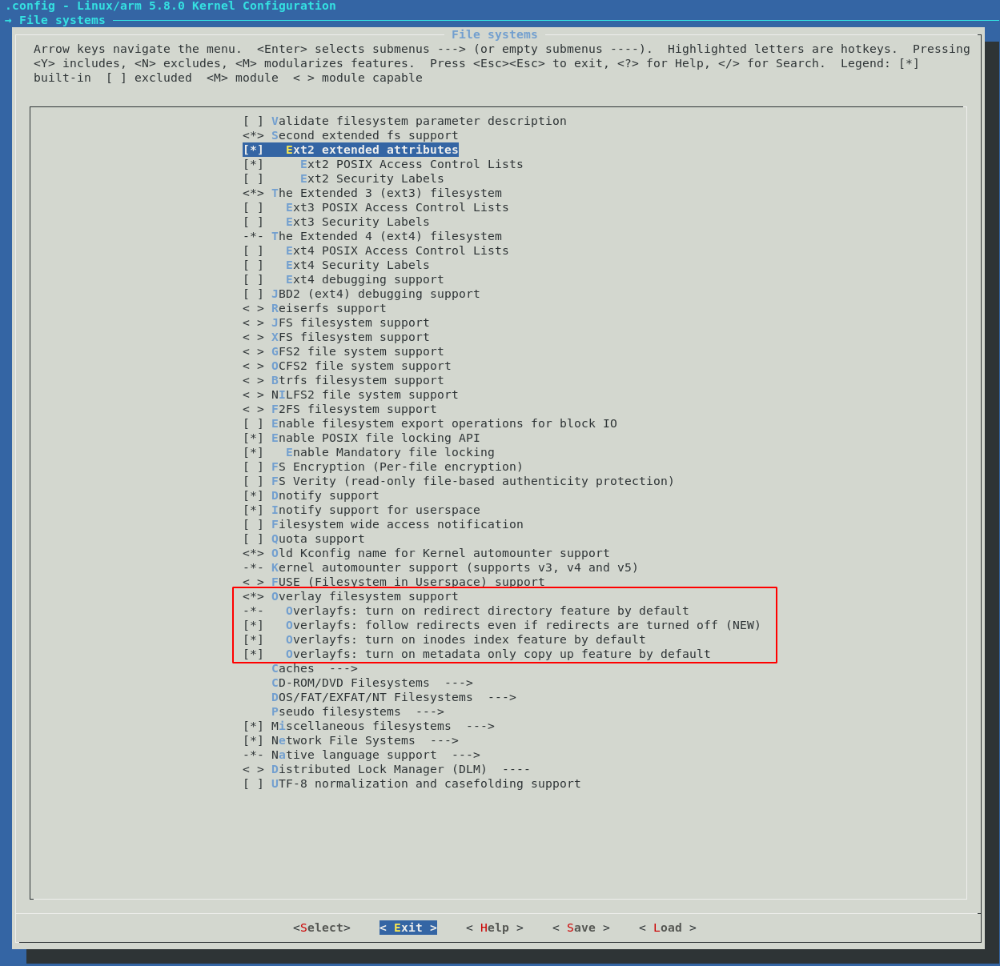

<!-- START doctoc generated TOC please keep comment here to allow auto update -->
<!-- DON'T EDIT THIS SECTION, INSTEAD RE-RUN doctoc TO UPDATE -->
**Table of Contents**  *generated with [DocToc](https://github.com/thlorenz/doctoc)*

  - [Summary](#summary)
  - [Steps](#steps)
    - [Library dependencies](#library-dependencies)
    - [Download the Kernel](#download-the-kernel)
    - [Configure the Kernel](#configure-the-kernel)
    - [Primer on Flashing FPGA](#primer-on-flashing-fpga)
    - [Kernel Options](#kernel-options)
      - [Do not append version](#do-not-append-version)
      - [Enable Overlay filesystem support](#enable-overlay-filesystem-support)
      - [Enable CONFIGFS](#enable-configfs)
      - [(Optional) Enable options for WIFI](#optional-enable-options-for-wifi)
    - [Build the Kernel image](#build-the-kernel-image)
- [References](#references)

<!-- END doctoc generated TOC please keep comment here to allow auto update -->

## Summary

Here we build a kernel for the DE10-Nano from scratch.

## Steps

### Library dependencies

The following packages are needed for compiling the kernel:

```bash
sudo apt-get install libncurses-dev flex bison openssl libssl-dev dkms libelf-dev libudev-dev libpci-dev libiberty-dev libmpc-dev libgmp3-dev autoconf bc
```

### Download the Kernel

Altera has their own fork of the kernel. You can clone the [altera linux repository](https://github.com/altera-opensource/linux-socfpga.git):

```bash
cd $DEWD
git clone https://github.com/altera-opensource/linux-socfpga.git
```

List the branches with `git branch -a` and checkout the one you want to use. We chose to use the latest available at the time of writing. What's the point of using an ancient kernel if you're going to all this trouble? 

```bash
cd linux-socfpga

# View the list of available branches.
git branch -a

# Use the branch you prefer.
git checkout socfpga-5.12
```

### Configure the Kernel

Initialize the configuration for the DE10-Nano:

```bash
make ARCH=arm socfpga_defconfig
```

Now open the kernel configuration window:

```bash
make ARCH=arm menuconfig
```

There are a few adjustments we want to make. But before that, let's understand a little bit about how to flash the FPGA on your DE10-Nano.

### Primer on Flashing FPGA

There are a few ways to flash your FPGA design. The traditional way is to just connect to the USB blaster interface and just flash it away. However, with the ARM HPS on our SoC, we have a couple of other ways as well:

1. **Flash from U-Boot on boot** - U-Boot has the ability to flash the FPGA design using some built-in commands. We will visit how to do this when we're building U-Boot.
2. **Flash from Linux while running** - I think this is one of the big benefits of having an HPS. We can flash our hardware design directly from Linux without even rebooting the device.

To be able to do this, we need to enable the **Overlay filesystem support** and **Userspace-driven configuration filesystem** in the kernel. If you don't intend to flash your FPGA from linux then feel free to skip these.

> **NOTE** - If you don't need these 2 options, you can just use the mainstream linux source to build your kernel instead of the altera-opensource version. Just clone the repository at `github.com/torvalds/linux`.

### Kernel Options

#### Do not append version

Under `General setup` and uncheck `Automatically append version information to the version string`. This makes it easier to test different versions of the drivers. Better to keep it enabled in production though.


#### Enable Overlay filesystem support

Under `File systems`, enable `Overlay filesystem support` and all the options under it:



#### Enable CONFIGFS

This should be enabled already, but if not, do enable it:


Feel free to look through the other options and when done, press the right-arrow key until `Exit` is highlighted and press enter. Keep exiting until you get a window that asks if you want to save config. Choose yes and that will exit you out of the utility.

#### (Optional) Enable options for WIFI

You can set up the necessary options needed for WIFI as explained [here](https://github.com/zangman/de10-nano/wiki/%5BOptional%5D-Setting-up-Wifi#compile-the-kernel-driver). This can be done later as well.

### Build the Kernel image

Now we can finally build the kernel image. Use the following command to create a kernel image called `zImage`:

```bash
make ARCH=arm LOCALVERSION=zImage -j 24
```

If it makes any complaints about `bc` not found or `flex` not found, install that utility using `sudo apt install <library>`.

The kernel gets compiled in about 5-10 mins on my Virtualbox Debian, but YMMV.

Once the compilation is complete, you now have a compressed Linux kernel image.

# References

[Building embedded linux for the Terasic DE10-Nano](https://bitlog.it/20170820_building_embedded_linux_for_the_terasic_de10-nano.html) - A large part of this page has been taken from here.

[Stackoverflow - Cannot mount configfs](https://stackoverflow.com/questions/50877808/configfs-do-not-mount-device-tree-overlays) - This page explains why you cannot see the device tree overlay.


