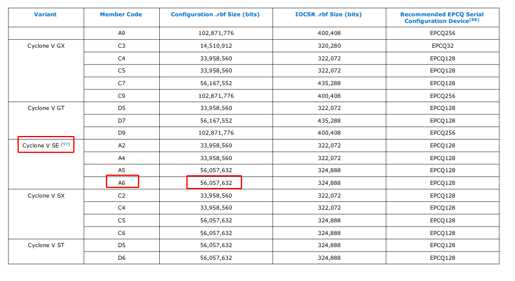

<p align="right"><sup><a href="Building-Embedded-Linux.md">Back</a> | <a href="Building-the-Kernel.md">Next</a> | </sup><a href="../README.md#getting-started"><sup>Contents</sup></a>
<br/>
<sup>Building Embedded Linux - Full Custom</sup></p>

# Building the Universal Bootloader (U-Boot)

## Summary

U-Boot is a universal bootloader. Truly. It is used in almost every known embedded device out there and the DE10-Nano is no exception. Here we will build a U-Boot image to be used for the DE10-Nano.

This step will also generate the Secondary Program Loader (SPL) along with the bootloader. To understand how all the pieces fit together, refer to this table originally shared on [Stack Overflow](https://stackoverflow.com/questions/31244862/what-is-the-use-of-spl-secondary-program-loader/31252989). We will generate both steps 2 and 3.

```
+--------+----------------+----------------+----------+
| Boot   | Terminology #1 | Terminology #2 | Actual   |
| stage  |                |                | program  |
| number |                |                | name     |
+--------+----------------+----------------+----------+
| 1      |  Primary       |  -             | ROM code |
|        |  Program       |                |          |
|        |  Loader        |                |          |
|        |                |                |          |
| 2      |  Secondary     |  1st stage     | u-boot   |
|        |  Program       |  bootloader    | SPL      |
|        |  Loader (SPL)  |                |          |
|        |                |                |          |
| 3      |  -             |  2nd stage     | u-boot   |
|        |                |  bootloader    |          |
|        |                |                |          |
| 4      |  -             |  -             | kernel   |
|        |                |                |          |
+--------+----------------+----------------+----------+
```

## Steps

### Getting the sources

There are two source repositories for U-Boot - the official [U-Boot repo](https://github.com/u-boot/u-boot) and the [altera fork](https://github.com/altera-opensource/u-boot-socfpga) of the U-Boot repo. You can use either of them and honestly, I don't know if any difference exists. For this guide, we will be using the official U-Boot repo because a [patch](https://lists.denx.de/pipermail/u-boot/2019-April/367258.html) had been submitted for it and it worked fine when I tested it.

Clone the repository:

```bash
cd $DEWD
git clone https://github.com/u-boot/u-boot.git
```

List all the tags and select a release that you want to use. For this guide, I used the latest stable release `v2021.07`:

```bash
cd $DEWD/u-boot

# List all available tags.
git tag

# Checkout the desired release.
git checkout v2021.07
```

### Configuring

#### Part 1 - Customizing the bootloader for the DE10-Nano

Here we will make a few changes to the source code to make it work more nicely with our DE10-Nano, viz.,

- Configure U-Boot to flash FPGA automatically at boot time.
- Assign a permanent mac address to the ethernet device.

These steps are optional i.e. you can skip them and your bootloader will work great and you will only lose these 2 capabilities. If you prefer to get something up and running asap, then you can skip directly to Part 2 and come back to it later when you feel you need it.

##### Creating a new branch

We want to keep our changes separate from the branch synced with the repo. So let's create a new branch:

```bash
git checkout -b v2021.07_mine_fpga_boot_mac
```

##### Configure U-Boot to flash FPGA automatically at boot time

One of the features of U-Boot is the ability to flash the FPGA with a binary design at boot time. If you have a design that you want running on the FPGA every time you turn on the device, this is a very useful feature. How to use this is explained in another section, but for now, we need to add some commands that will do this automatically.

We will edit the following file for this:

```bash
cd $DEWD/u-boot
nano include/config_distro_bootcmd.h
```

Towards the end of the file, look for the following lines:

```bash
  BOOT_TARGET_DEVICES(BOOTENV_DEV)                                  \
  \
  "distro_bootcmd=" BOOTENV_SET_SCSI_NEED_INIT                      \
    BOOTENV_SET_NVME_NEED_INIT                                \
    BOOTENV_SET_IDE_NEED_INIT                                 \
    BOOTENV_SET_VIRTIO_NEED_INIT                              \
    "for target in ${boot_targets}; do "                      \
      "run bootcmd_${target}; "                         \
    "done\0"

#ifndef CONFIG_BOOTCOMMAND
#define CONFIG_BOOTCOMMAND "run distro_bootcmd"
#endif
```

We will modify the variable `distro_bootcmd` to load the FPGA design from the FAT partition. So modify it to look like this:

```bash
  BOOT_TARGET_DEVICES(BOOTENV_DEV)                                  \
  \
  "distro_bootcmd= " \
    "if test -e mmc 0:1 u-boot.scr; then " \
      "echo --- Found u-boot.scr ---; " \
      "fatload mmc 0:1 0x2000000 u-boot.scr; " \
      "source 0x2000000; " \
    "elif test -e mmc 0:1 soc_system.rbf; then " \
      "echo --- Programming FPGA ---; " \
      "fatload mmc 0:1 0x2000000 soc_system.rbf; " \
      "fpga load 0 0x2000000 0x700000; " \
    "else " \
      "echo u-boot.scr and soc_system.rbf not found in fat.; " \
    "fi; " \
    BOOTENV_SET_SCSI_NEED_INIT                      \
    BOOTENV_SET_NVME_NEED_INIT                                \
    BOOTENV_SET_IDE_NEED_INIT                                 \
    BOOTENV_SET_VIRTIO_NEED_INIT                              \
    "for target in ${boot_targets}; do "                      \
      "run bootcmd_${target}; "                         \
    "done\0"

#ifndef CONFIG_BOOTCOMMAND
#define CONFIG_BOOTCOMMAND "run distro_bootcmd"
#endif
```

Quick explanation of what we're doing here. `distro_bootcmd` sets up the u-boot sequence of commands and at the end launches the kernel with `run bootcm_${target}`.

We're modifying this command to do two things.

1.  First, we check to see if a u-boot script file exists on the fat partition called `u-boot.scr`. If it does we load it into memory at `0x2000000` and then run it using the `source` command.

    Having the check for `u-boot.scr` is helpful to override the default sequence of commands by creating a boot script image file `u-boot.scr` and saving it in the fat partition. This way we don't have to compile u-boot and burn it to the sd card every time we need some custom configuration. This may come in handy in the future.

1.  Next, if the script file is not found, then we check if `soc_system.rbf` exists on the fat partition. If it does then, we load the design named `soc_system.rbf` into memory address `0x2000000` and in the next step, copy `0x700000` bytes from the memory location `0x2000000` into the FPGA. I obtained these numbers by looking at [this article](https://rocketboards.org/foswiki/Documentation/EmbeddedLinuxBeginnerSGuide) (Section titled "Writing the boot script") and by looking up in the source code.

    Presumably, `0x2000000` is the RAM address where we want to copy the contents of the binary and `0x700000` is the size of the binary in bytes. But where does `0x700000` or `7MB` come from? Well, if we look in the [Cyclone V Device Data Sheet](https://www.intel.com/content/dam/www/programmable/us/en/pdfs/literature/hb/cyclone-v/cv_51002.pdf) on page 78, we see a table showing the size of `.rbf` configuration files in bits. Here is a screenshot:

    
    The de10-nano uses a Cyclone V 5CSEBA6U23I7 and I've highlighted that above. So converting that from bits to MB, we get about `6.68MB` which is close to the `7MB` above.

After making the changes, save the file and exit. Then commit it to the branch.

```bash
git add .
git commit -m "Load FPGA on boot."
```

##### Asssign a permanent mac address to the ethernet device

By default, the ethernet device on the DE10-Nano isn't assigned a Mac address. So it assigns a random one every time you reboot the device. Which in turn leads to a different IP address every time, which makes sshing into it a bit tedious. You could run the commands to assign the mac address at boot time as shown in the appendix, but then you'll have to do that every time you make changes to the SD Card. By adding it to the source code, you avoid both these problems.

Let's generate a random mac address first. You can get it online if you like, but U-Boot already ships with one out of the box. Let's use that:

```bash
cd $DEWD/u-boot

# Compile the mac address generator.
make -C tools gen_eth_addr

# Run it!
tools/gen_eth_addr
```

You should get an address that looks like `56:6b:20:e9:4a:47`. Copy this and save it somewhere.

Now let's assign this to our device. To do this, open the following file in a text editor. I am using `nano` but you can use `vim`, `gedit` or any other editor:

```bash
cd $DEWD/u-boot
nano include/configs/socfpga_common.h
```

Scroll down to the section that has the following lines:

```bash
#ifndef CONFIG_EXTRA_ENV_SETTINGS
#define CONFIG_EXTRA_ENV_SETTINGS \
        "fdtfile=" CONFIG_DEFAULT_FDT_FILE "\0" \
        "bootm_size=0xa000000\0" \
        "kernel_addr_r="__stringify(CONFIG_SYS_LOAD_ADDR)"\0" \
        "fdt_addr_r=0x02000000\0" \
        "scriptaddr=0x02100000\0" \
        "pxefile_addr_r=0x02200000\0" \
        "ramdisk_addr_r=0x02300000\0" \
        "socfpga_legacy_reset_compat=1\0" \
        BOOTENV

#endif
```

Modify this to add the U-Boot environment variable `ethaddr` as shown below. Don't forget the `\0` at the end as well as the `\` or it won't work.

```bash
#ifndef CONFIG_EXTRA_ENV_SETTINGS
#define CONFIG_EXTRA_ENV_SETTINGS \
        "fdtfile=" CONFIG_DEFAULT_FDT_FILE "\0" \
        "bootm_size=0xa000000\0" \
        "kernel_addr_r="__stringify(CONFIG_SYS_LOAD_ADDR)"\0" \
        "fdt_addr_r=0x02000000\0" \
        "scriptaddr=0x02100000\0" \
        "pxefile_addr_r=0x02200000\0" \
        "ramdisk_addr_r=0x02300000\0" \
        "socfpga_legacy_reset_compat=1\0" \
        "ethaddr=56:6b:20:e9:4a:47\0" \
        BOOTENV

#endif
```

You can save the file and exit. We're done with this step. Let's commit our changes:

```bash
git add .
git commit -m "Added mac address"
```

> **Note**: To those familiar with version management, saving hard coded mac addresses, passwords and any other kind of sensitive data in a repository is a definite no-no. But since this is for hobby use and on my own personal router, and I only have one DE10-Nano board, it should be fine. If you are doing this for your company, you might not want to hard code the mac address in the header file, it is not scalable. Instead, you should follow the steps in the Appendix which show how to set the mac address in the U-Boot console on first boot. Also, you shouldn't rely on the random mac generator and you should actually buy some valid mac addresses. Refer to [this link](https://www.denx.de/wiki/view/DULG/WhereCanIGetAValidMACAddress) for more info.

#### Part 2 - Finish the configuration

U-Boot has a number of pre-built configurations in the `configs` folder. To view all the available ones for altera, run the following command:

```bash
cd $DEWD/u-boot
ls -l configs/socfpga*
```

We will be using `socfpga_de10_nano_defconfig`.

Prepare the default config:

```bash
make ARCH=arm socfpga_de10_nano_defconfig
```

The defaults should be fine. But should you choose to fine tune the config, you can run the following and update them:

```bash
make ARCH=arm menuconfig
```

### Building

Now we can build U-Boot. Run the following command:

```bash
make ARCH=arm -j 24
```

Once the compilation completes, it should have generated the file `u-boot-with-spl.sfp`. This is the bootloader combined with the secondary program loader (spl).

## References

[Official U-Boot repository](https://github.com/u-boot/u-boot) - The README has most of the instructions.

[Building embedded linux for the Terasic DE10-Nano](https://bitlog.it/20170820_building_embedded_linux_for_the_terasic_de10-nano.html) - This page is again a very useful reference.

## Appendix

### Setting the mac address at boot time

If you skipped the section on hardcoding the mac address, you can change it at boot time as well. When the device boots, you can interrupt autoboot and enter the following commands to set the mac address. Note that this particular environment variable can only be set once and once set, cannot be changed:

```bash
setenv ethaddr 56:6b:20:e9:4a:47
saveenv
```

##

<p align="right">Next | <b><a href="Building-the-Kernel.md">Building the Kernel</a></b>
<br/>
Back | <b><a href="Building-Embedded-Linux.md">The Basics</a></p>
</b><p align="center"><sup>Building Embedded Linux - Full Custom | </sup><a href="../README.md#building-embedded-linux---full-custom"><sup>Table of Contents</sup></a></p>
