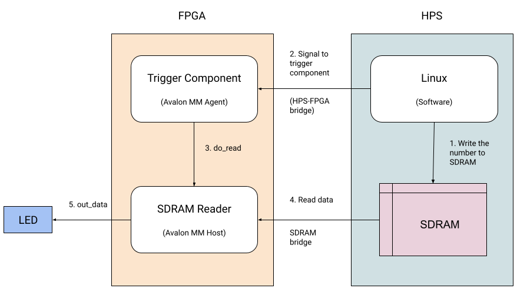

## Summary

We're going to talk a bit about the user experience and put together a simple Agent/Slave component that acts as the trigger for our Host/Master component that we're going to put together in the next section.

## User Experience

The end user experience in the first stage should be as follows:

 1. User boots up the device and logs into Linux on the HPS.
 1. User writes software which populates a number in a specific memory address which corresponds to the SDRAM.
 1. User then signals to the Trigger component that the address is ready to be used.
 1. Trigger component signals to the SDRAM Reader component to initiate the transaction.
 1. SDRAM Reader component then initiates the read transaction and makes the number available in the signal `out_data`.
 1. This signal is then wired to the LEDs on the de10-nano to confirm that the data has been received successfully.

The image below shows the general approach:




## Trigger Component

We will need a trigger component that will initiate the read transaction. This will utilise the HPS-FPGA bridge in a similar way as was explained in the [Simple Adder](https://github.com/zangman/de10-nano/wiki/Simple-Hardware-Adder:-Custom-Avalon-MM-Components) project.

But the difference is that we only need send a boolean value i.e. "Begin transaction". We don't really care about the data. So this will be an Avalon Agent component and we'll just use the `write` signal.

The code for this slave component is as follows:

```verilog
module avalon_control(
  /* verilator lint_off UNUSED */
  input logic clk,
  input logic reset,
  input logic [31:0] avs_s0_writedata,
  /* verilator lint_on UNUSED */
  input logic avs_s0_write,
  output logic do_read
);

// Write anything to trigger a write.
// Without a waitrequest from the agent (this module)
// the `write` signal is asserted for exactly one cycle.
assign do_read = avs_s0_write;

endmodule
```

This is as simple as a component can be.

In the next section, we'll create the main SDRAM Reader component which will be triggered by this component.
