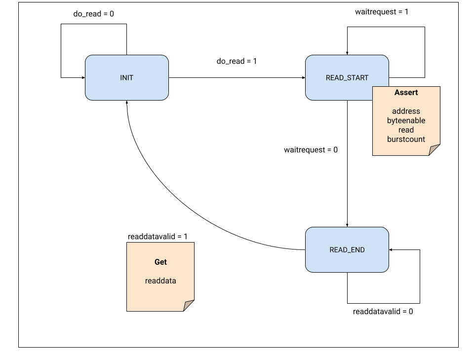

<p align="right"><sup><a href="FPGA-SDRAM-Communication_-Avalon-MM-Agent-Slave-Trigger-Component.md">Back</a> | <a href="FPGA-SDRAM-Communication_-Avalon-MM-Host-Master-Component-Part-2.md">Next</a> | </sup><a href="../README.md#fpga---sdram-communication"><sup>Contents</sup></a>
<br/>
<sup>FPGA - SDRAM Communication</sup></p>

# Avalon MM Host/Master - 1

## Summary

Here we'll go through the steps of designing our Avalon MM Host (Master) Component in SystemVerilog which interfaces with the SDRAM Controller. We'll begin with a simple component that reads a byte from SDRAM and makes it available externally.

For a beginner, this is quite complicated. So, to make it easier to follow, I've broken it down into separate parts.

## State Machine

From the section on the [Avalon MM Read and Write interfaces](./FPGA-SDRAM-Communication_-More-about-the-Avalon-Memory-Mapped-Interface.md#avalon-mm-bidirectional-port-signals-for-sdram-controller), it is quite obvious that we need to implement a state machine. For a read transaction, I can think of three different states:

1. **INIT** - When we're idle and ready to start a transaction.
2. **READ_START** - When we're initiated the read transaction and waiting for the `waitrequest` to be de-asserted.
3. **READ_END** - When we're waiting for `readdatavalid` to be asserted.

In addition to this, I would like to have a way to control the host component by means of a signal that is available externally. I call this `do_read`.

Based on this information, I put together this rough diagram for the state machine:



## Signals

Let's start putting together the signals for our component. We'll need all the signals that are used for a burst read and write interface and the additional `byteenable` signal.

We also need an input signal `do_read` which tells the component to start the read process and an output signal `out_data` to make the data available externally.

Prefixing `avm_m0` for all the Avalon MM signals makes it easier for Platform Designer to interpret these and saves a bit of time when creating the component.

We're going to ignore the write signals in this project. But the approach to use them should be similar to reading.

```verilog
module avalon_sdr (
    // clk and reset are always required.
    input   logic         clk,
    input   logic         reset,
    // Bidirectional ports i.e. read and write.
    output  logic         avm_m0_read,
    output  logic         avm_m0_write,
    output  logic [255:0] avm_m0_writedata,
    output  logic [31:0]  avm_m0_address,
    input   logic [255:0] avm_m0_readdata,
    input   logic         avm_m0_readdatavalid,
    output  logic [31:0]  avm_m0_byteenable,
    input   logic         avm_m0_waitrequest,
    output  logic [10:0]  avm_m0_burstcount,
    // External.
    input   logic         do_read,
    output  logic [255:0] out_data
);
```

## State Changes

We'll create `localparam`s to hold the state definitions. Since we only have three states, 2 bits are sufficient to hold the state value.

> Note: For a primer on Finite State Machines, I've found this [PDF](https://inst.eecs.berkeley.edu/~cs150/sp12/resources/FSM.pdf) from UC Berkeley very helpful.

```verilog
localparam INIT = 2'd0;
localparam READ_START = 2'd1;
localparam READ_END = 2'd2;

logic [1:0] cur_state;
logic [1:0] next_state;
```

Let's add some code to change state only on the positive edge of `clk`:

```verilog
always_ff @(posedge clk) begin
  if (reset) cur_state <= INIT;
  else cur_state <= next_state;
end
```

Let's create a combinational block to declare the conditions for state change. In this section, we are only assigning the value of `next_state` depending on the current values of `do_read`, `waitrequest` and `readdatavalid`. You can see how these dictate the state transitions in the image above.

```verilog
always_comb begin
  next_state = cur_state;
  case(cur_state)
    INIT: begin
      if (do_read) next_state = READ_START;
    end

    READ_START: begin
      if (avm_m0_waitrequest) next_state = READ_START; // Wait here.
      else next_state = READ_END;
    end

    READ_END: begin
      if (!avm_m0_readdatavalid) next_state = READ_END; // Wait here.
      else next_state = INIT;
    end

    default: begin
      next_state = INIT;
    end
  endcase
end
```

## Populating Control Values

We'll define another combinational block where we declare the various control values of the host i.e. `address`, `read`, `byteenable`, `burstcount`. As per the specifications, we need to keep asserting all these values for as long as the agent asserts `waitrequest` or for a minimum of one clock cycle. Which is why, we populate these values in `READ_START` and set them to `0` in all other states.

Strictly speaking, the only value that really need to set to `0` in all other states is the `read` signal. The other values don't matter if `read` isn't asserted. But I'm just setting them here for completeness.

```verilog
always_comb begin
  avm_m0_address = 32'd0;
  avm_m0_read = 1'b0;
  avm_m0_byteenable = 32'd0;
  avm_m0_burstcount = 11'd0;

  case(cur_state)

    READ_START: begin
      avm_m0_address = 32'h2000_0000;
      avm_m0_read = 1'b1;
      avm_m0_byteenable = 32'h0000_000F; // Get 32 bits only.
      avm_m0_burstcount = 11'd1; // Get only 1 address value.
    end

    default: begin
    end
  endcase
end
```

## Retain the last read value

We want to retain the last read value until we read again. This is done by assigning to `out_data` in a synchronous block. We only populate it when the `readdatavalid` signal is asserted:

```verilog
always_ff @(posedge clk) begin
  if (reset) out_data <= 256'd0;
  else begin
    case (cur_state)
      READ_END: begin
        if (avm_m0_readdatavalid) begin
          out_data <= avm_m0_readdata;
        end
      end

      default: begin
      end
    endcase
  end
end
```

## Full code

The entire code for our host component is given below:

```verilog
module avalon_sdr (
  // clk and reset are always required.
  input   logic         clk,
  input   logic         reset,
  // Bidirectional ports i.e. read and write.
  output  logic         avm_m0_read,
  output  logic         avm_m0_write,
  output  logic [255:0] avm_m0_writedata,
  output  logic [31:0]  avm_m0_address,
  input   logic [255:0] avm_m0_readdata,
  input   logic         avm_m0_readdatavalid,
  output  logic [31:0]  avm_m0_byteenable,
  input   logic         avm_m0_waitrequest,
  output  logic [10:0]  avm_m0_burstcount,
  // External.
  input   logic         do_read,
  output  logic [255:0] out_data
);

localparam INIT = 2'd0;
localparam READ_START = 2'd1;
localparam READ_END = 2'd2;

logic [1:0] cur_state;
logic [1:0] next_state;

always_ff @(posedge clk) begin
  if (reset) cur_state <= INIT;
  else cur_state <= next_state;
end

always_comb begin
  next_state = cur_state;
  case(cur_state)
    INIT: begin
      if (do_read) next_state = READ_START;
    end

    READ_START: begin
      if (avm_m0_waitrequest) next_state = READ_START; // Wait here.
      else next_state = READ_END;
    end

    READ_END: begin
      if (!avm_m0_readdatavalid) next_state = READ_END; // Wait here.
      else next_state = INIT;
    end

    default: begin
      next_state = INIT;
    end
  endcase
end

always_comb begin
  avm_m0_address = 32'd0;
  avm_m0_read = 1'b0;
  avm_m0_byteenable = 32'd0;
  avm_m0_burstcount = 11'd0;

  case(cur_state)

    READ_START: begin
      avm_m0_address = 32'h2000_0000;
      avm_m0_read = 1'b1;
      avm_m0_byteenable = 32'h0000_000F; // Get 32 bits only.
      avm_m0_burstcount = 11'd1; // Get only 1 address value.
    end

    default: begin
    end
  endcase
end

always_ff @(posedge clk) begin
  if (reset) out_data <= 256'd0;
  else begin
    case (cur_state)
      READ_END: begin
        if (avm_m0_readdatavalid) begin
          out_data <= avm_m0_readdata;
        end
      end

      default: begin
      end
    endcase
  end
end

endmodule
```

## Simulation and Verification

Unfortunately, simulation and verification is a full blown topic in itself and I don't think I can do justice to it. I am woefully inexperienced in them and to get the component above working, all I could do was simulate the signals of the agent that this component would interact with in [Verilator](https://www.veripool.org/verilator/) and see if the waveforms were behaving as I'd expect them to. Since at the time of designing this component, I wasn't sure of how the bus behaves, this was a lot of trial and error and it took several days to get this component finally working.

A better way I believe is to use the [Avalon Bus Functional Models IP](https://www.intel.com/content/dam/www/programmable/us/en/pdfs/literature/ug/ug_avalon_verification_ip.pdf) to test and verify that your component is indeed behaving the way it's supposed to. But I spent a few days trying to understand this and get it to work and I couldn't make head or tail of it. I abandoned it to just get this project completed.

I am not an expert at Verilator, but just in case someone finds it useful, sharing the full source code of my simulation program below. If you are interested in learning more, I have found [Dan's tutorials at ZipCPU](https://zipcpu.com/tutorial/) very very helpful when I was starting out:

```C++
#include "Vavalon_sdr.h"
#include "verilated.h"
#include "verilated_vcd_c.h"

#include <iostream>
#include <memory>

void tick(int count, Vavalon_sdr *tb, VerilatedVcdC *tfp,
          VerilatedContext *context) {
  for (int i = 0; i < count; ++i) {
    // Evaluate all signal updates before rising edge.
    tb->eval();

    tb->clk = 1;
    tb->eval();
    tfp->dump(context->time());
    context->timeInc(1);

    tb->clk = 0;
    tb->eval();
    tfp->dump(context->time());
    context->timeInc(1);
  }
}

void run_with_wait(Vavalon_sdr *tb, VerilatedVcdC *tfp,
                   VerilatedContext *context) {
  // Signal do_read for only 1 cycle.
  tb->do_read = 1;
  // Assert waitrequest before next rising clock.
  tb->avm_m0_waitrequest = 1;
  tick(1, tb, tfp, context);
  tb->do_read = 0;

  // Let waitrequest be asserted for 5 cycles.
  tick(5, tb, tfp, context);

  // waitrequest deasserted and readdata provided at the same time
  // for one clock cycle.
  tb->avm_m0_waitrequest = 0;
  tb->avm_m0_readdata[0] = 33;

  tick(1, tb, tfp, context);
  tb->avm_m0_readdata[0] = 0;

  tick(5, tb, tfp, context);
}

void run_without_wait(Vavalon_sdr *tb, VerilatedVcdC *tfp,
                      VerilatedContext *context) {
  tb->do_read = 1;
  tb->avm_m0_readdata[0] = 33;
  tick(1, tb, tfp, context);
  tb->do_read = 0;
  tb->avm_m0_readdata[0] = 0;

  tick(10, tb, tfp, context);

  tb->do_read = 1;
  tb->avm_m0_readdata[0] = 33;
  tick(1, tb, tfp, context);
  tb->do_read = 0;
  tb->avm_m0_readdata[0] = 0;

  tick(10, tb, tfp, context);
}

void run_with_wait_and_datavalid(Vavalon_sdr *tb, VerilatedVcdC *tfp,
                                 VerilatedContext *context) {
  // Initial state.
  tb->avm_m0_readdata[0] = 0;
  tb->avm_m0_readdatavalid = 0;
  tb->avm_m0_waitrequest = 0;

  // High for 1 cycle to signal start.
  tb->do_read = 1;

  tick(1, tb, tfp, context);

  tb->do_read = 0;
  tb->avm_m0_waitrequest = 1;
  tick(4, tb, tfp, context);

  tb->avm_m0_waitrequest = 0;
  tick(4, tb, tfp, context);

  tb->avm_m0_readdatavalid = 1;
  tb->avm_m0_readdata[0] = 33;
  tick(1, tb, tfp, context);

  tb->avm_m0_readdatavalid = 0;
  tb->avm_m0_readdata[0] = 0;
  tick(4, tb, tfp, context);
}

int main(int argc, char **argv, char **env) {
  Verilated::commandArgs(argc, argv);
  Verilated::traceEverOn(true);
  auto tb = std::make_unique<Vavalon_sdr>();

  auto context = std::make_unique<VerilatedContext>();
  auto tfp = std::make_unique<VerilatedVcdC>();

  tb->trace(tfp.get(), 99);
  tfp->open("simx.vcd");

  tb->reset = 1;

  tick(1, tb.get(), tfp.get(), context.get());

  tb->reset = 0;

  tick(1, tb.get(), tfp.get(), context.get());

  run_with_wait_and_datavalid(tb.get(), tfp.get(), context.get());

  tfp->close();

  return 0;
}
```

## References

[Finite State Machines in Verilog](https://inst.eecs.berkeley.edu/~cs150/sp12/resources/FSM.pdf) - Excellent article that explains state machines in great detail.

[ZipCPU Tutorials](https://zipcpu.com/tutorial/) - Excellent tutorials for beginners especially on verilator.

##

<p align="right">Next | <b><a href="FPGA-SDRAM-Communication_-Avalon-MM-Host-Master-Component-Part-2.md">Avalon MM Host/Master - 2</a></b>
<br/>
Back | <b><a href="FPGA-SDRAM-Communication_-Avalon-MM-Agent-Slave-Trigger-Component.md">Avalon MM Agent/Slave - Trigger Component</a></p>
</b><p align="center"><sup>FPGA - SDRAM Communication | </sup><a href="../README.md#fpga---sdram-communication"><sup>Table of Contents</sup></a></p>
