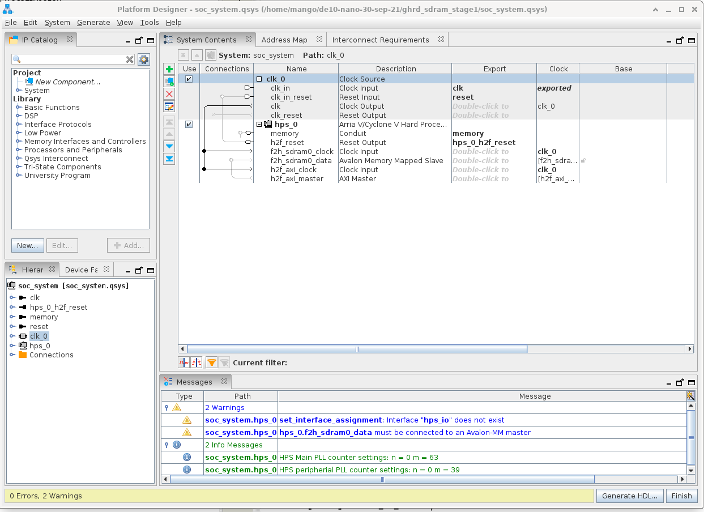
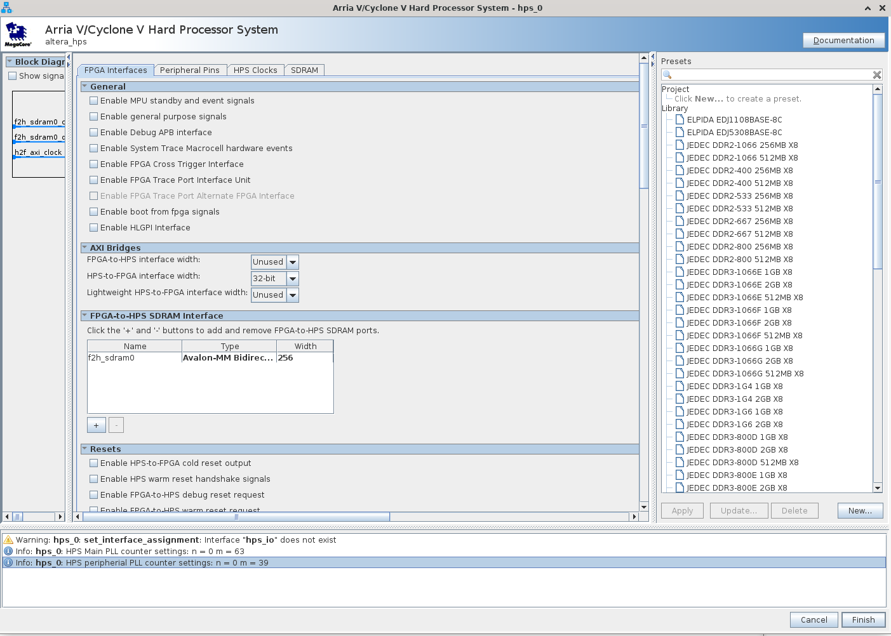
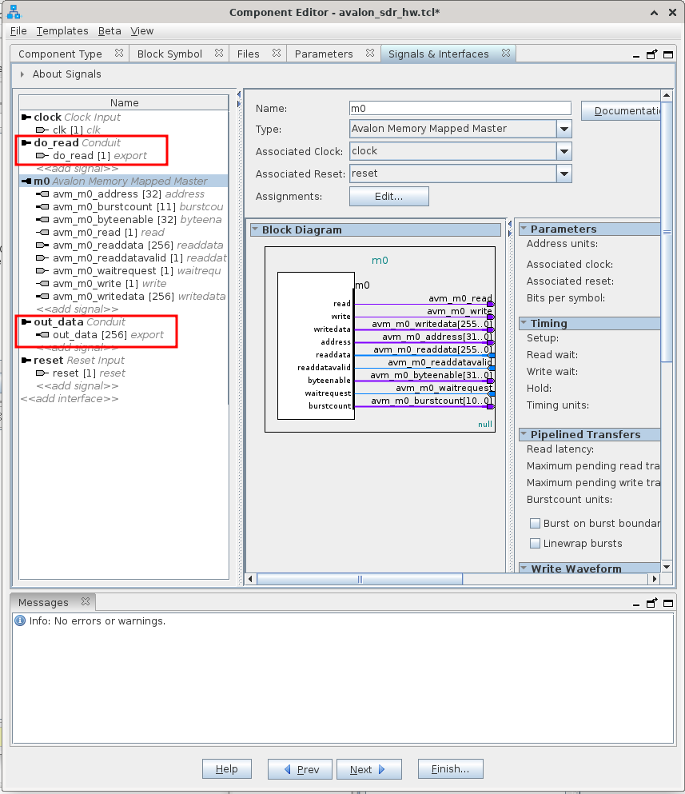
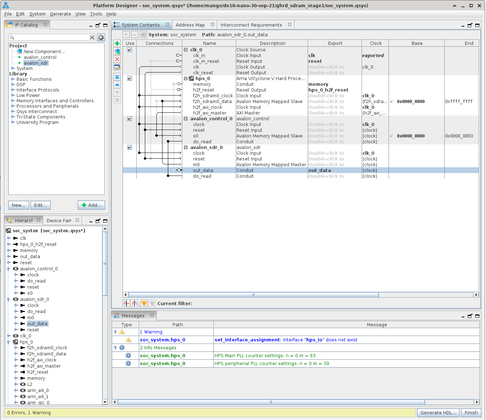
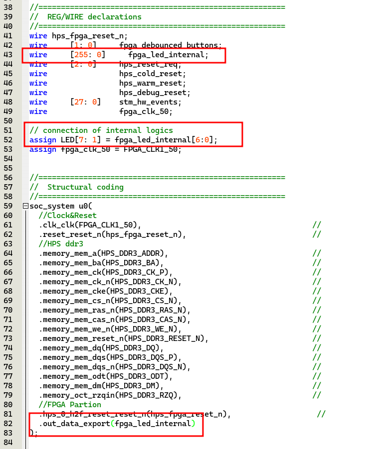
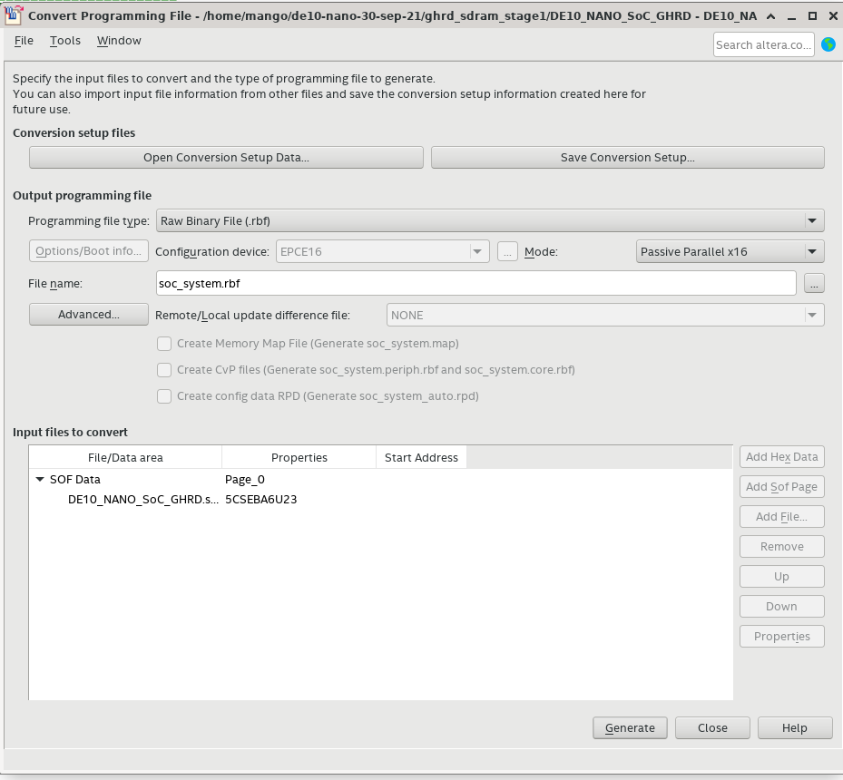

<!-- START doctoc generated TOC please keep comment here to allow auto update -->
<!-- DON'T EDIT THIS SECTION, INSTEAD RE-RUN doctoc TO UPDATE -->

- [Summary](#summary)
- [Building the project](#building-the-project)
  - [Initial setup](#initial-setup)
  - [New component - Avalon Control](#new-component---avalon-control)
  - [New component Avalon SDR](#new-component-avalon-sdr)
  - [Wiring the components](#wiring-the-components)
  - [Connecting the LEDs](#connecting-the-leds)
  - [Convert to rbf](#convert-to-rbf)

<!-- END doctoc generated TOC please keep comment here to allow auto update -->

<!-- START doctoc -->
<!-- END doctoc -->

## Summary

Here we will go through the steps of setting the host component up in Platform Designer and wiring it up to the top level design in the project.

## Building the project

### Initial setup

We will use a copy of the `ghrd_barebones_template` that we created over [here](./Simple-Hardware-Adder_-Initial-Project-Setup.md#create-a-backup-of-this-project). If you don't have it, follow the steps as shown on [this page](./Simple-Hardware-Adder_-Initial-Project-Setup.md) to have a clean initial project to start with.

Make a copy of the template first:

```bash
cd $DEWD
cp -r ghrd_barebones_template ghrd_sdram
```

Now fire up Quartus and open the new project. First thing to do is open up Platform Designer, this can be done by going to `Tools > Platform designer` and open `soc_system.qsys`.

You should see something similar to this:



Right click on `hps_0` and select `Edit...`. Make sure the options are as shown in the screenshot below:



### New component - Avalon Control

This is the trigger component that we created earlier. We'll call it `avalon_control` and we'll create a new agent component. I won't go into great detail in creating this as it's already explained in the [Simple Adder](./Simple-Hardware-Adder_-Custom-Avalon-MM-Components.md) project. Here is a screenshot that shows what the signals tab looks like:


The signal `do_read` should be declared as a conduit for both, the trigger component and the sdram reader component. Then we can just wire them together in platform designer.

Save this new component.

### New component Avalon SDR

This is the main reader component. We'll call it `avalon_sdr` and create a new component as before. Here's the screenshot of the signals tab:



We are marking both signals `do_read` and `out_data` as conduits.

> Note: We could have combined both components into a single component. A component can consist of multiple files and multiple hosts and agents within it. However I felt it's more convenient to do it this way.

### Wiring the components

Add the trigger component and the reader component and wire them together as shown in the image below. Remember to export `out_data` so that it's available for the LED in our top level entity. Once they're all wired you shouldn't have any errors or warnings (except the hps_io warning, I haven't figured out how to remove that :))



Now save the design with `Ctrl+S` and then click the button that says `Generate HDL...` at the bottom right. When it completes you can click `Finish` to close Platform Designer.

### Connecting the LEDs

Back in Quartus, modify the top level design for the LED signal.



I have increased the width of the `fpga_led_internal` signal to 256 bits to match `out_data`. And then am wiring up the first 7 bits to the LED.

Once this is done, you can compile the design and if everything went well, there shouldn't be any errors.

### Convert to rbf

Once the compilation succeeds, go to `File > Convert Programming Files` as shown in the screenshot below:



Normally we would have flashed the design as explained [here](./Flash-FPGA-from-HPS-running-Linux.md) and [here](./Flash-FPGA-On-Boot-Up.md). But in this case, we need to set some registers on the HPS otherwise the HPS will hang as soon as we try to read.

Let's cover this in the next section.
