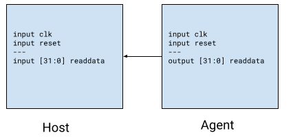
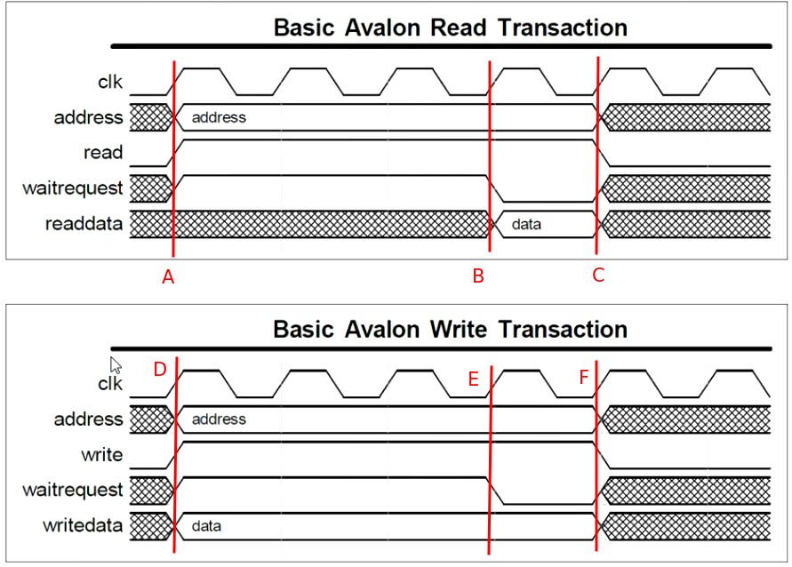
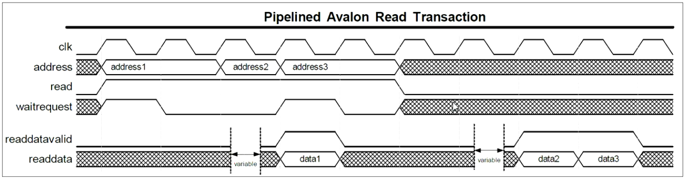
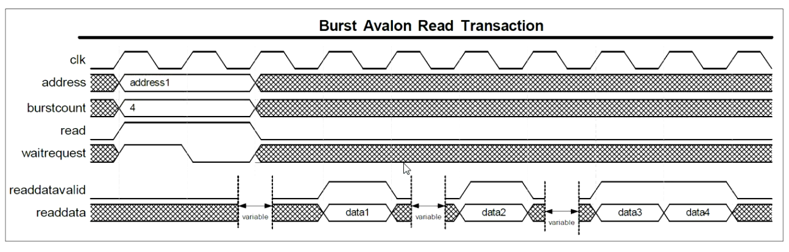
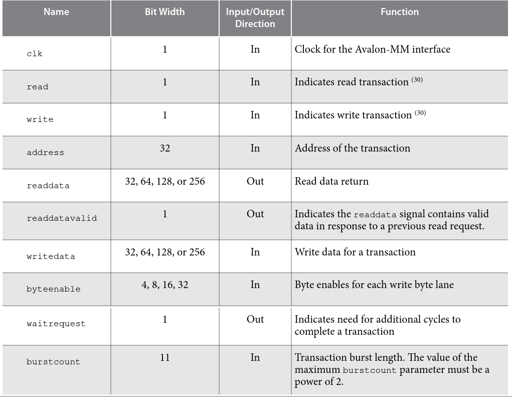
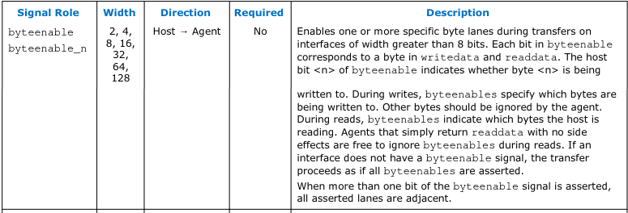

<!-- START doctoc generated TOC please keep comment here to allow auto update -->
<!-- DON'T EDIT THIS SECTION, INSTEAD RE-RUN doctoc TO UPDATE -->
**Table of Contents**  *generated with [DocToc](https://github.com/thlorenz/doctoc)*

- [Summary](#summary)
- [Avalon MM Transactions](#avalon-mm-transactions)
  - [Basic Avalon MM Read/Write](#basic-avalon-mm-readwrite)
  - [Avalon MM Pipelined Read/Write](#avalon-mm-pipelined-readwrite)
  - [Avalon MM Burst Read/Write](#avalon-mm-burst-readwrite)
- [Avalon MM Bidirectional Port Signals for SDRAM Controller](#avalon-mm-bidirectional-port-signals-for-sdram-controller)
- [References](#references)

<!-- END doctoc generated TOC please keep comment here to allow auto update -->

## Summary

This is a follow up to the [Primer on Avalon MM](https://github.com/zangman/de10-nano/wiki/Simple-Hardware-Adder:-Primer-on-Avalon-Memory-Map-Interface). If you haven't read that, please take a quick scan and then continue on this page. Here we talk a little bit about the different types of Avalon MM transactions.

## Avalon MM Transactions

Avalon is a fairly comprehensive bus architecture. The kinds of transactions that one can do with Avalon are wide and varied. As you try to get more efficient with your transactions (Ex: get more throughput), the complexity of the transaction increases. The complexity also increases if you are writing a Host (Master) component versus an Agent (Slave) component. While an agent just has to respond to whatever responses are being made by a host, the host on the other hand has to not only respond to the agent's responses but also manage the bus to make sure the agent receives the instructions correctly.

In the [Simple Hardware Adder](https://github.com/zangman/de10-nano/wiki/Simple-Hardware-Adder:-Custom-Avalon-MM-Components) we had created agent components. This was because there was already a host provided by the HPS-FPGA bridge. But for the SDRAM controller, since there is no host, we will need to develop our own host component.

But before that, let's walk through a few simple transaction types with commonly used signals. The HPS SDRAM controller uses the **Avalon MM Burst Interface**. So it is necessary for us to understand how this is implemented if we wish to design our own custom host component. The Burst interface builds upon the Pipelined interface which builds upon the basic read/write interface. Which is why we cover all three below.

The content below is mostly sourced from this [9 minute video](https://www.youtube.com/watch?v=8GAqT3nzHeQ). I strongly recommend watching this one, it was a lightbulb moment for me. Below, I will try and expand a bit more over what the video covers. But if everything in the video makes sense to you, feel free to just skip to the [last section](https://github.com/zangman/de10-nano/wiki/FPGA-SDRAM-Communication:-More-about-the-Avalon-Memory-Mapped-Interface#avalon-mm-bidirectional-port-signals-for-sdram-controller) which shows the ports required for the host component.

### Basic Avalon MM Read/Write

For a component that wishes to read, the absolute minimum signal needed to be compliant with Avalon bus specs is `readdata`.

For a component that wishes to write, the absolute minimum signals needed are `write` and `writedata`.

The direction in which information flows decides which side needs to be the agent and which side the host. `readdata` always flows from the agent to the host. `writedata` always flows from the host to the agent.

As an example, if we were to have a minimal host component that reads data from a slave, the minimum requirements are as shown below:

In this case, the agent always returns a value in `readdata` and the host just has to sample it when needed.

Usually we need more signals to enable some communication between the host and the agent. Some typical scenarios that Avalon bus covers are:

* The agent can return multiple values and so we need some kind of addressing. We'll require the `address` signal.
* Perhaps the agent needs to read and write as well.
* Maybe the agent takes several clock cycles to have the data ready for the host to read. In this case, we can use the `waitrequest` signal.

This would be a good point to watch the [first part of the video](https://www.youtube.com/watch?v=8GAqT3nzHeQ) to see how these signals interact between the host and the agent for a basic read and write transaction. Here is a screenshot from the video with state changes on the bus that I've marked in red:

Note that the shaded areas of the waveform show the regions where Avalon makes no guarantee about the signal value. So we can make no assumption of the values in these regions.

The waveforms are explained below:

* **Read Transaction**
  * *State A*:
    * `address` and `read` are driven by the host.
    * `waitrequest` driven high by the agent on the same edge when `read` is driven high. Note that this is only if the agent needs time to process/fetch the data. If it's not needed, the agent doesn't have to assert `waitrequest`.
    * Also note that `waitrequest` might be asserted independent of the `read` state. The agent might have already asserted it even before the `read` was asserted.
    * For as long as `waitrequest` is asserted, host must keep `address` and `read` constant.
  * *State B*:
    * The agent de-asserts `waitrequest` and populates `readdata`. Both of these will be sampled by the host on the very next positive edge of `clk`.
  * *State C*:
    * The host samples `readdata`. 
    * This completes the transaction and the host should now de-assert `read`.
* **Write Transaction**
  * *State D*:
    * `address`, `write` and **`writedata`** are driven by the host.
    * `waitrequest` is driven high by the agent on the same edge when `write` is driven high.
    * For as long as `waitrequest` is asserted, host must keep `address`, `write` and **`writedata`** constant.
  * *State E*:
    * The agent de-asserts `waitrequest`.
  * *State F*:
    * The agent samples `writedata` at the first rising edge of `clk` after `waitrequest` is de-asserted.
    * This completes the transaction and the host should now de-assert `write`.

### Avalon MM Pipelined Read/Write

On the surface, the only difference between a Pipelined transaction and a Basic transaction is the signal `readdatavalid`. But the presence of this signal changes the game.

A Pipelined interface allows the host to separate the requests from the responses i.e. they can operate independently from each other. Let's look at the screenshot from the video below:

* When the agent asserts `waitrequest`, the host should keep the `address` and the `read` signals constant.
* When the agent de-asserts `waitrequest`, the host is free to keep the `read` signal high and provide additional addresses to the agent to respond with data.
* The host doesn't have to wait for the agent to respond with the data for any of the addresses before requesting for more data. The host can make the requests and get the responses in parallel.
* Whenever the agent has data to respond with, it asserts the `readdatavalid` signal and populates `readdata` until the next positive edge of `clk`, which is when the host should sample `readdata`.
* Subsequent responses from the agent can be captured by the host in the same way i.e. with the `readdatavalid` signal going high. The data is returned in the same order in which the addresses are sent.

### Avalon MM Burst Read/Write

Burst transactions build on the Pipelined transaction with the addition of the signal `burstcount`. The host uses this signal to inform the agent to return a specified number of data units or words. The size of each word is the size of `readdata`. So we can see how this is especially useful for memory requests such as SDRAM where I wish to fetch data in continuous memory locations starting from one address.

Since Burst interfaces are Pipelined interfaces as well, the rest of the behaviour is exactly the same as a Pipelined interface. The only difference is that we provide only a single address value.

Here is a screenshot from the video:

We will use the Burst interface for our host component.

## Avalon MM Bidirectional Port Signals for SDRAM Controller

The image below is taken from the [Cyclone V Technical Reference Manual](https://www.intel.com/content/dam/www/programmable/us/en/pdfs/literature/hb/cyclone-v/cv_54001.pdf) which shows all the ports that we need to consider when putting together our host component:

It includes all the signals required for the Burst interface and one additional signal - `byteenable`. This signal is used to let the agent know which 8 bits of the read/write data the host is interested in reading or writing to.

So if `readdata` is 256 bits wide, `byteenable` will require 256/8 = 32 bits. If we are only interested in the first 8 bits of the data returned by the agent, then the host sets `byteenable` to `32'h0000_0001`.

Screenshot below taken from the [Avalon Technical Spec](https://www.intel.com/content/dam/www/programmable/us/en/pdfs/literature/manual/mnl_avalon_spec.pdf): 

With this understanding under our belt, we can now proceed to building our Host component.

## References

[Understanding Avalon MM Bursting](https://www.youtube.com/watch?v=8GAqT3nzHeQ) - Never mind the title. This video explains in fantastic detail how Avalon MM reads and writes happen and it does it in 5 minutes. Definitely worth watching.

[Avalon Technical Spec](https://www.intel.com/content/dam/www/programmable/us/en/pdfs/literature/manual/mnl_avalon_spec.pdf) - This is a handy reference for the technical specs of Avalon Bus. I had difficulty with the Avalon MM examples because I felt they were more complex than they needed to me and made it difficult to understand. The video above is what made everything clear to me. Still this reference is useful to know what the different signals are and how they are used.

[Cyclone V HPS Technical Reference Manual](https://www.intel.com/content/dam/www/programmable/us/en/pdfs/literature/hb/cyclone-v/cv_54001.pdf) - The SDRAM Controller section in this doc has details about the Avalon MM Ports and about the various features of the controller itself.