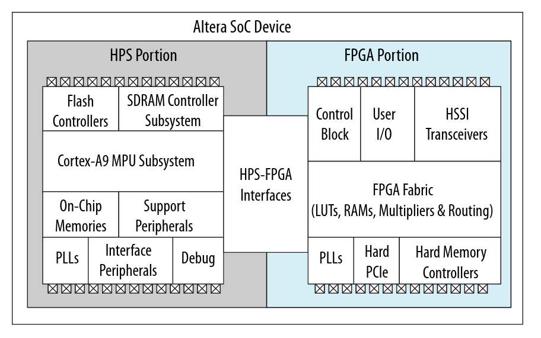
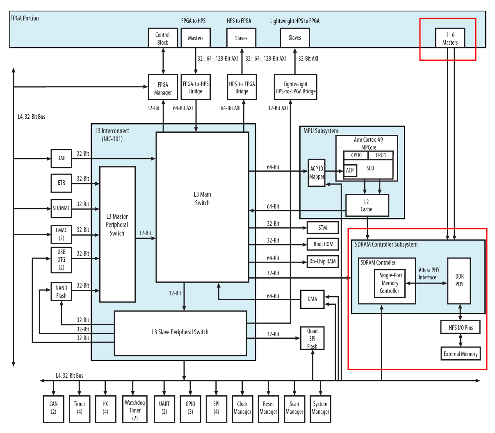

<a href="FPGA-SDRAM-Communication_-Introduction.md">Back</a> | <a href="FPGA-SDRAM-Communication_-More-about-the-Avalon-Memory-Mapped-Interface.md">Next</a> | <a href="../README.md#fpga---sdram-communication">Contents</a>
 
FPGA - SDRAM Communication

# SDRAM Controller

<!-- START doctoc generated TOC please keep comment here to allow auto update -->
<!-- DON'T EDIT THIS SECTION, INSTEAD RE-RUN doctoc TO UPDATE -->

- [Summary](#summary)
- [Block Diagram](#block-diagram)
- [Approach - Custom Avalon MM Master](#approach---custom-avalon-mm-master)
- [References](#references)

<!-- END doctoc generated TOC please keep comment here to allow auto update -->

## Summary

Here we'll go into some high level detail on the SDRAM controller present on the HPS. I am not an expert, so I will try my best to explain this the way I understand it.

## Block Diagram

The diagram below is taken from Chapter 2: Introduction to the Hard Processor System in the [Cyclone V HPS Technical Reference Manual](https://www.intel.com/content/dam/www/programmable/us/en/pdfs/literature/hb/cyclone-v/cv_54001.pdf).

You can see that the SDRAM controller is squarely in the HPS portion of the chip. So when writing logic in the FPGA fabric, we need to use the HPS-FPGA interfaces block to interact with the SDRAM Controller Subsystem which then fetches the memory we need at the address we want.

Below is a more detailed block diagram of how everything is wired up:

As you can see in the highlighted sections, the way the FPGA is connected to the SDRAM controller completely bypasses the L3 Main switch. The other bridges such as the FPGA-to-HPS and Lightweight FPGA-to-HPS bridges are routed via the L3 Main Switch. This allows (as I understand it) for much faster memory access.

Another interesting thing to note is that the SDRAM controller allows upto 6 independent masters to work simultaneously and access the SDRAM directly. This can be configured in Platform Designer.

## Approach - Custom Avalon MM Master

For our basic requirement, we'll be writing our own Custom Avalon MM Master Component which will perform all the steps necessary to read from and write to the 1 GB SDRAM available on the de10-nano. We will talk more about this in the next section.

## References

[Cyclone V HPS Technical Reference](https://www.intel.com/content/dam/www/programmable/us/en/pdfs/literature/hb/cyclone-v/cv_54001.pdf)

Next | <b><a href="FPGA-SDRAM-Communication_-More-about-the-Avalon-Memory-Mapped-Interface.md">More on Avalon MM</a></b>
 
Back | <b><a href="FPGA-SDRAM-Communication_-Introduction.md">Introduction</a>

</b>
FPGA - SDRAM Communication | <a href="../README.md#fpga---sdram-communication">Table of Contents</a>

