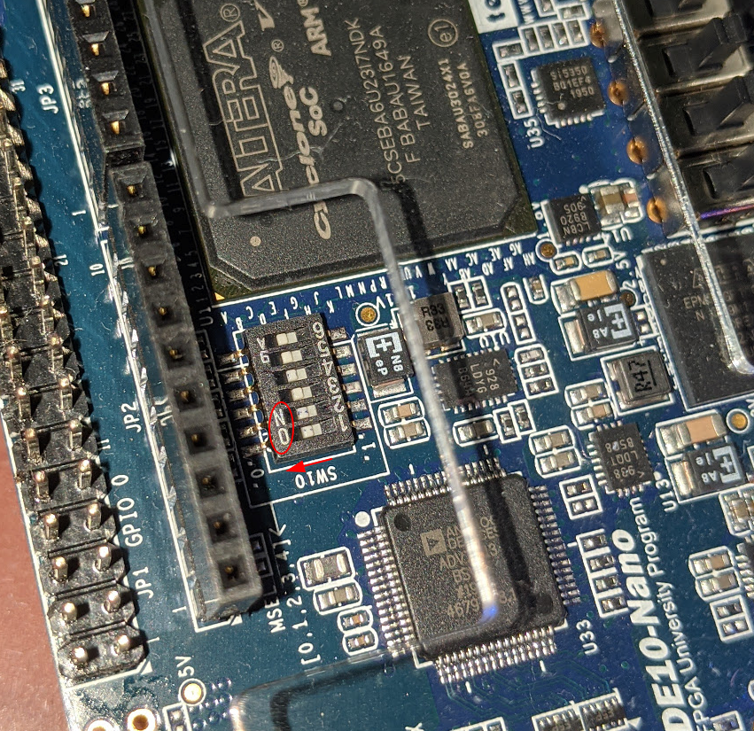
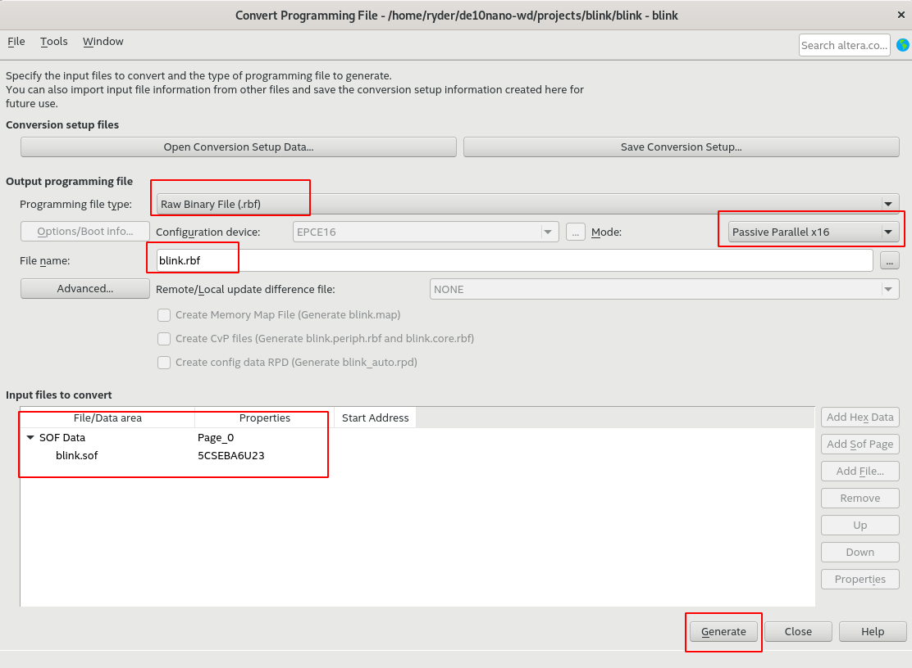

<!-- START doctoc generated TOC please keep comment here to allow auto update -->
<!-- DON'T EDIT THIS SECTION, INSTEAD RE-RUN doctoc TO UPDATE -->
**Table of Contents**  *generated with [DocToc](https://github.com/thlorenz/doctoc)*

- [Summary](#summary)
- [Steps](#steps)
  - [Set the MSEL pins](#set-the-msel-pins)
  - [Create a blink design](#create-a-blink-design)
  - [Creating the device tree overlay](#creating-the-device-tree-overlay)
  - [Compiling the device tree overlay](#compiling-the-device-tree-overlay)
  - [Flash the FPGA](#flash-the-fpga)
  - [Updating the design](#updating-the-design)
- [References](#references)

<!-- END doctoc generated TOC please keep comment here to allow auto update -->

## Summary

This document details how to update the FPGA design from Linux without having to reboot the machine. 

> **NOTE** - It is assumed that you followed the kernel configuration steps as detailed in the [building kernel](building_kernel.md) page. If not, please follow the configuration steps and copy the `zImage` file onto the SD Card. You will not be able to follow the steps otherwise.

## Steps

### Set the MSEL pins

The MSEL pins on the DE10-Nano should be all set to `ON` for this to work:



### Create a blink design

To explain the process, let's create a simple LED blinking design as follows:

```verilog
module blink (
    input clk,
    output led
);
    reg [26:0] counter;
    
    always @(posedge clk) counter <= counter + 1'b1;
    
    assign led = counter[26];
endmodule
```

Compile this design in quartus as you normally would and generate the `.sof` file. If you need a refresher, refer to [this tutorial](https://software.intel.com/content/www/us/en/develop/articles/how-to-program-your-first-fpga-device.html) to compile the FPGA (no need to program it).

After the `.sof` is generated, we need to convert it to an `.rbf` file which will be used to program the FPGA in linux.

In quartus, go to `File`> `Convert Programming Files` and this will open the utility window. Set the options to match the screenshot below and hit generate.



Once generated, copy this over to the DE10-Nano using scp to the root folder:

```bash
scp blink.rbf root@<ipaddress>:~
```

### Creating the device tree overlay

Device tree overlays are the way to flash an FPGA from Linux. We do this by creating an overlay for the FPGA region and then updating the device tree while Linux is running. This is not permanent, it will be reset if you reboot the system.

If you look in the device tree source file in `$DEWD/u-boot/arch/arm/dts/socfpga.dtsi`, you will see that there is a node called `base_fpga_region` which is a child of the node `soc`. We will create a device tree overlay to update this particular node.

Using `ssh` or the serial terminal, log onto the DE10-Nano and create a new file in the root folder and call it `blink.dtso`. Copy the content below and paste it in the file:

```c
/dts-v1/;
/plugin/;

/{
	fragment@0 {
    	target-path = "/soc/base_fpga_region";
        __overlay__ {
	    #address-cells = <1>;
            #size-cells = <1>;
            firmware-name = "blink.rbf";
        };
    };
};

```

In our case the binary that we want to flash on the FPGA is called `blink.rbf`. If your file is named something else, rename this accordingly.

### Compiling the device tree overlay

We'll need the device tree compiler. Thankfully, since we're running debian, this is easy to install. Run the following command in the DE10-Nano

```bash
apt install device-tree-compiler
```

Once it completes, we can now compile the device tree with the following command:

```bash
dtc -O dtb -o blink.dtbo -b 0 -@ blink.dtso
```

This will generate the device tree binary `blink.dtbo`.

Your root folder should now contain all three files:

```bash
blink.dtso
blink.dtbo
blink.rbf
```

### Flash the FPGA

For this to work, the `.dtbo` and the `.rbf` should both be copied to the folder `/lib/firmware`. If it doesn't exist, create it:

```bash
mkdir -p /lib/firmware
cp blink.dtbo /lib/firmware
cp blink.rbf /lib/firmware
```

Now let's mount the configfs to get access to the device tree. We'll do this in `/config` and will create it if it doesn't exist:

```bash
mkdir -p /config
mount -t configfs configfs /config
```

When you look inside `/config`, you should see something similar to the following:

```bash
root@de10-nano:~# ls -lrthR /config
/config:
total 0
drwxr-xr-x 3 root root 0 Jan  1  1970 device-tree

/config/device-tree:
total 0
drwxr-xr-x 2 root root 0 Jan  1  1970 overlays

/config/device-tree/overlays:
total 0
root@de10-nano:~#
```

Let's create a new folder in the overlays folder:

```bash
cd /config/device-tree/overlays

# The folder can be named anything.
mkdir blink
```

The folder should now look like this:

```bash
root@de10-nano:/config/device-tree/overlays# ls -lrthR blink
blink:
total 0
-r--r--r-- 1 root root 4.0K Sep 14 16:45 status
-rw-r--r-- 1 root root 4.0K Sep 14 16:45 path
-rw-r--r-- 1 root root    0 Sep 14 16:45 dtbo
root@de10-nano:/config/device-tree/overlays#
```

Now we pass the name of the device tree binary to the path file and if all goes well, our LED should now blink as expected:

```bash
echo -n "blink.dtbo" > blink/path
```

Verify that the design has been successfully applied:

```bash
root@de10-nano:/config/device-tree/overlays# cat blink/status
applied
```

### Updating the design

To update the design, we need to first remove the old node using `rmdir`. This can be run without deleting the files inside:

```bash
rmdir blink
```

Then follow the steps as per the previous section to flash the new design.

## References

[Zynq PL programming with FPGA Manager](https://xilinx-wiki.atlassian.net/wiki/spaces/A/pages/18841645/Solution+Zynq+PL+Programming+With+FPGA+Manager) - This page has the details that work for version 5.5 of the kernel.