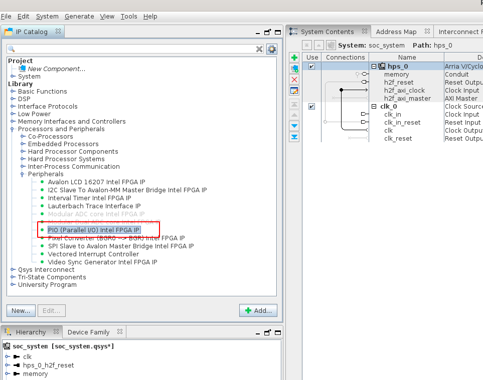
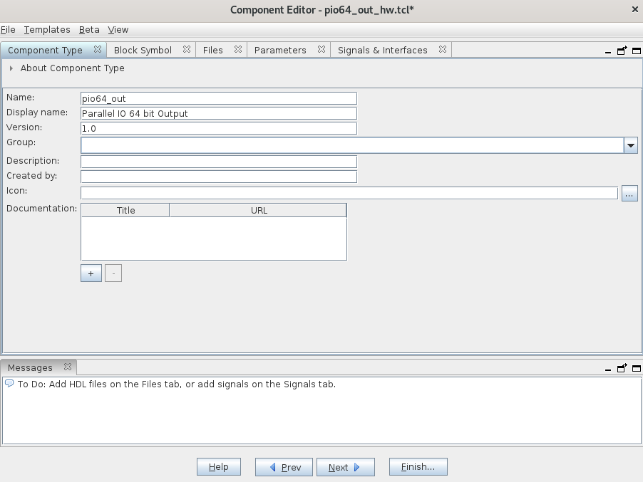
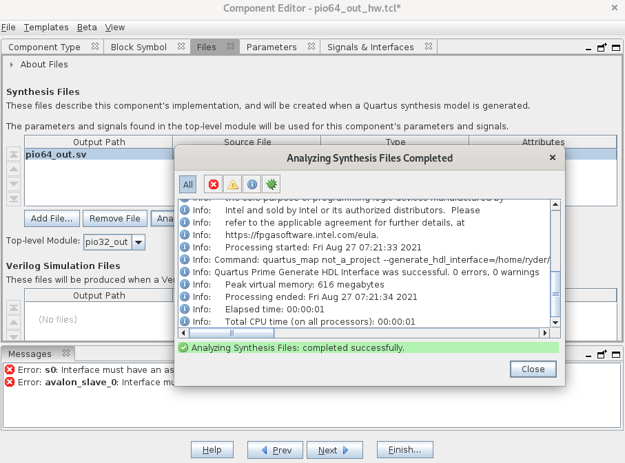
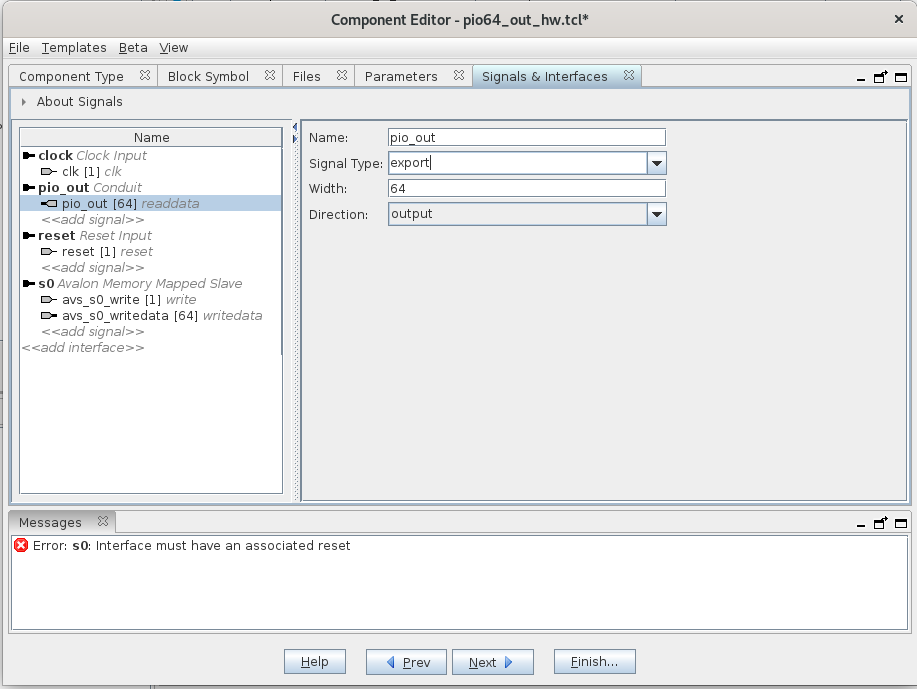
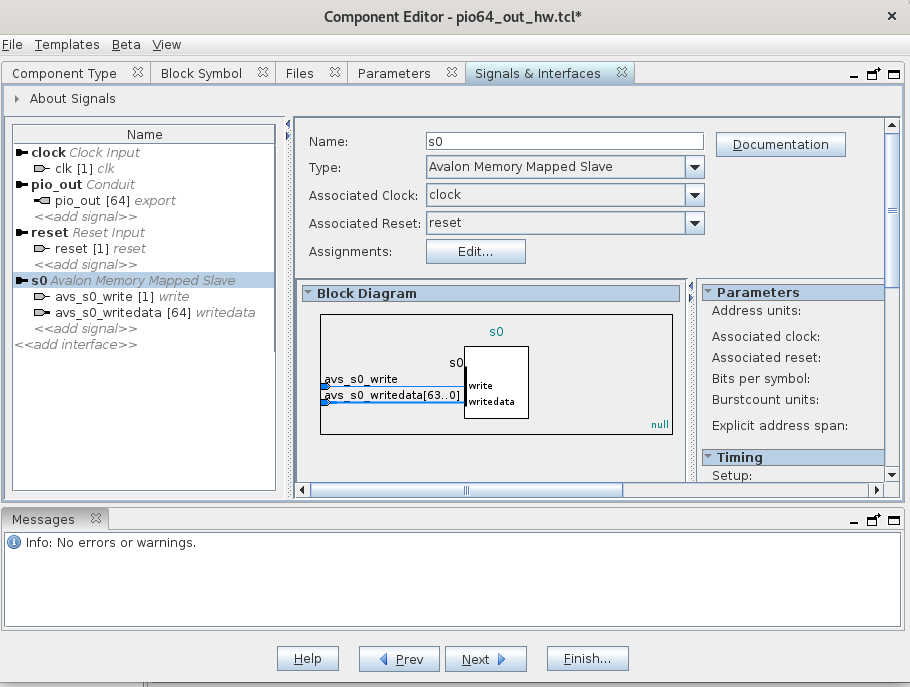
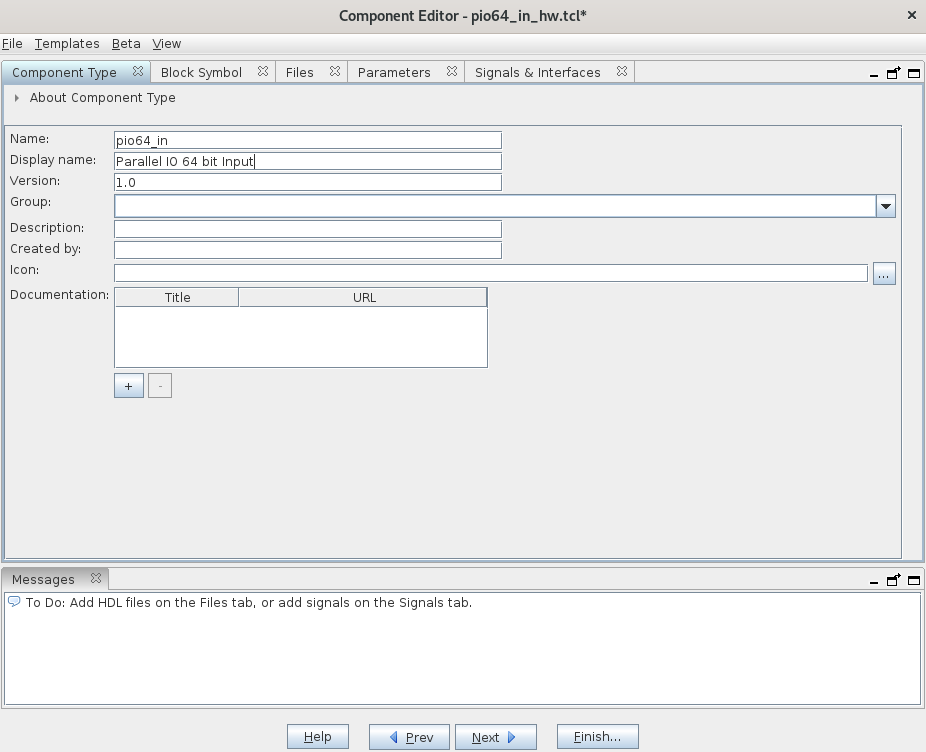
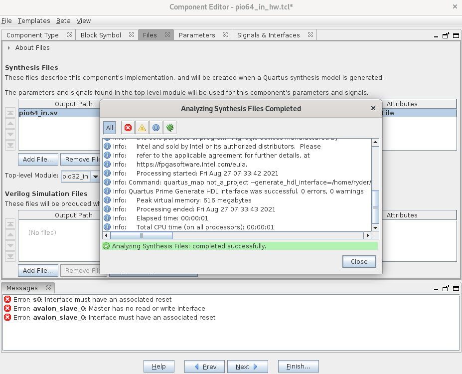
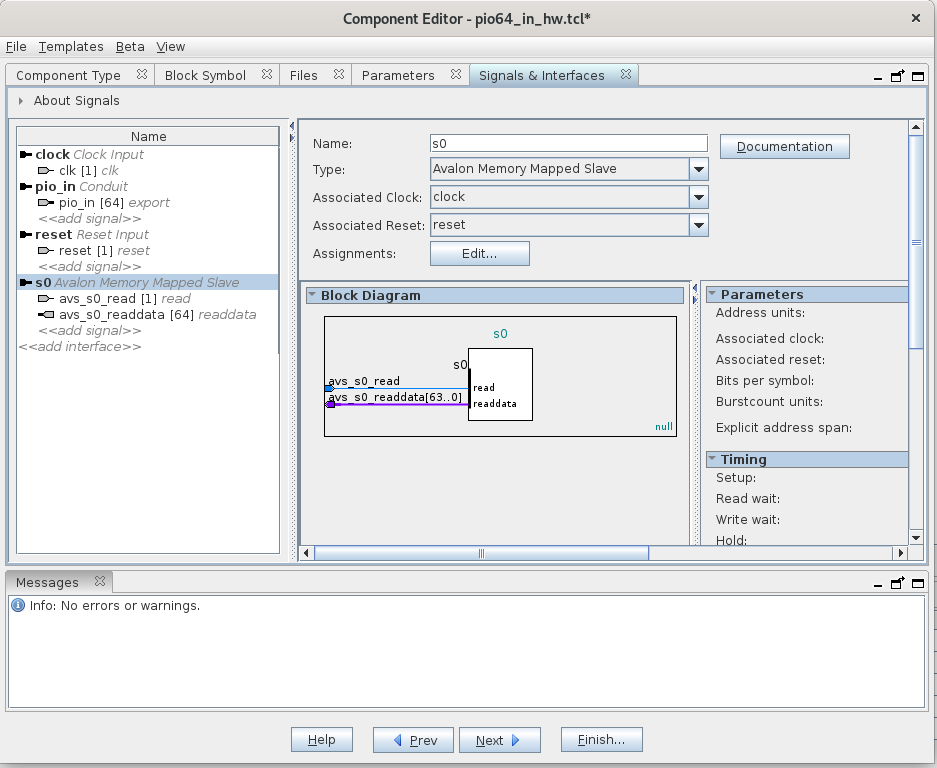

<p align="right"><sup><a href="Simple-Hardware-Adder_-Primer-on-Avalon-Memory-Map-Interface.md">Back</a> | <a href="Simple-Hardware-Adder_-Wiring-the-components.md">Next</a> | </sup><a href="../README.md#my-first-soc---simple-hardware-adder"><sup>Contents</sup></a>
<br/>
<sup>My First SoC - Simple Hardware Adder</sup></p>

# Custom Avalon MM Components

## Summary

Here we walk through the steps to create simple Avalon MM Components that will help us interface with our simple adder.

## Goal of the custom components

We want a way to write and read data to our simple adder. If you recall, the adder has only 3 ports - 2 inputs (`a` and `b`) and 1 output (`sum`). For this, we will create custom Input/Output (IO) components that will enable us to read them.

## IP Catalog

Hang on, this is so basic, surely there should be something readily available to help us do this? There is and that is where the IP Catalog comes in. This is what you see on the left hand side of Platform Designer. There are so many ready to use components that you can just drag and drop into your design.

Normally that's what you would use because they are tried and tested. In fact, there is one module that is designed for exactly this purpose and you may have seen other examples online using it. It's called the Parallel I/O peripheral and can be found as shown:



But there are few reasons I'm not using this one:

1. Many examples online already demonstrate how to use this component. In fact, it's demonstrated in the GHRD also when you open it. You can use it to write to the onboard LEDs.
2. The parallel IO only goes up to 32 bits and not more. Our adder takes 64 bits.
3. Let's build our own components, it's more fun! :)

## Custom Parallel IO (PIO) Components

Now let's look into how we'll write these. Since we have 2 inputs to our adder and one output, we'll need 2 different kinds of components. One which will allow us to write to and one which will allow us to read from. Let's look at these now.

Note that when we say `output` for a custom component, we are referring to the direction of the port that is actually used in the component itself. So an `output` component will be connected to the `input`s of our adder and vice versa.

### Parallel IO Output 64 bit

Looking at our interface requirements for Avalon Memory Map, we will require the following ports:

- clk
- reset
- write - Flag to indicate whether we are writing or not.
- writedata - Actual data that is passed.
- pio_out - The port that connects to one of the inputs of our adder.

With this, I have come up with the following module which serves our purpose:

```systemverilog
module pio64_out (
  input logic clk,
  input logic reset,

  input logic avs_s0_write,
  input logic [63:0] avs_s0_writedata,

  output logic [63:0] pio_out
);

always_ff @ (posedge clk) begin
  if (reset) begin
    pio_out <= '0;
  end else if (avs_s0_write) begin
    pio_out <= avs_s0_writedata;
  end else begin
    pio_out <= pio_out;
  end
end

endmodule
```

Save this in our working directory:

```bash
cd $DEWD
mkdir -p ip/pio64
cd ip/pio64
vim pio64_out.sv
# Save the file here.
```

### Parallel IO Input 64 bit

Similarly, we will need the following ports for our input module:

- clk
- reset
- read - Flag to indicate whether we are reading or not.
- readdata - Actual data to return.
- pio_in - The port that connects to the output of our adder.

With this, we have the following design:

```systemverilog
module pio64_in (
  input logic clk,
  input logic reset,

  input logic avs_s0_read,
  output logic [63:0] avs_s0_readdata,

  input logic [63:0] pio_in
);

always_comb begin
  if (avs_s0_read) begin
    avs_s0_readdata = pio_in;
  end else begin
    avs_s0_readdata = 'x;
  end
end

endmodule
```

Save this in our working directory:

```bash
cd $DEWD
cd ip/pio64
vim pio64_in.sv
# Save the file here.
```

### Creating the components

#### Output component

Back in Platform Designer, click on the `New Component...` to start the wizard and fill in the details:



Now click on the tab `Files` and click on `Add File...` and select `pio64_out.sv`. Click on `Analyze Synthesis Files` and if there are no errors, it should complete successfully.



Click on `Signals & Interfaces` and make the following changes:

1. Rename `avalon_slave_0` to `pio64_out`.

2. Change the `Type` in the dropdown to `Conduit`.

3. Change the `Associated Reset` in the dropdown to `reset`.

4. Click on the signal `pio_out [64] readdata` in the left hand menu and type in `export` in the `Signal Type` field. It should like the image below:

   

5. Click on `s0` in the left hand menu and change `Associated Reset` to `reset`. It should now look as follows:
   

6. Save the component with `Ctrl + s` and hit `Finish...`.

#### Input Component

Create a new component for the input as well. Repeat the same steps as above but replace `out` with `in` to keep the naming convention consistent. Sharing what my screens look like:







And that creates our custom components! In the next section we'll start wiring everything together.

##

<p align="right">Next | <b><a href="Simple-Hardware-Adder_-Wiring-the-components.md">Wiring the Components</a></b>
<br/>
Back | <b><a href="Simple-Hardware-Adder_-Primer-on-Avalon-Memory-Map-Interface.md">Primer on Avalon MM</a></p>
</b><p align="center"><sup>My First SoC - Simple Hardware Adder | </sup><a href="../README.md#my-first-soc---simple-hardware-adder"><sup>Table of Contents</sup></a></p>
