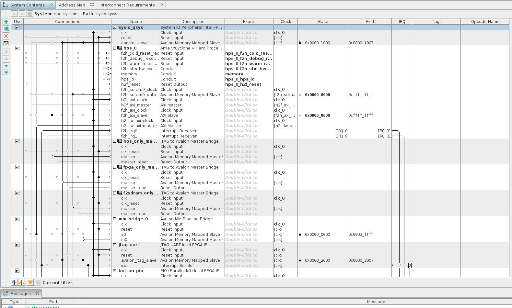
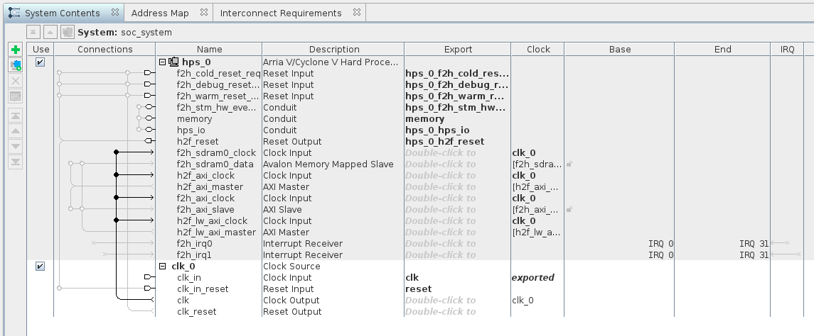
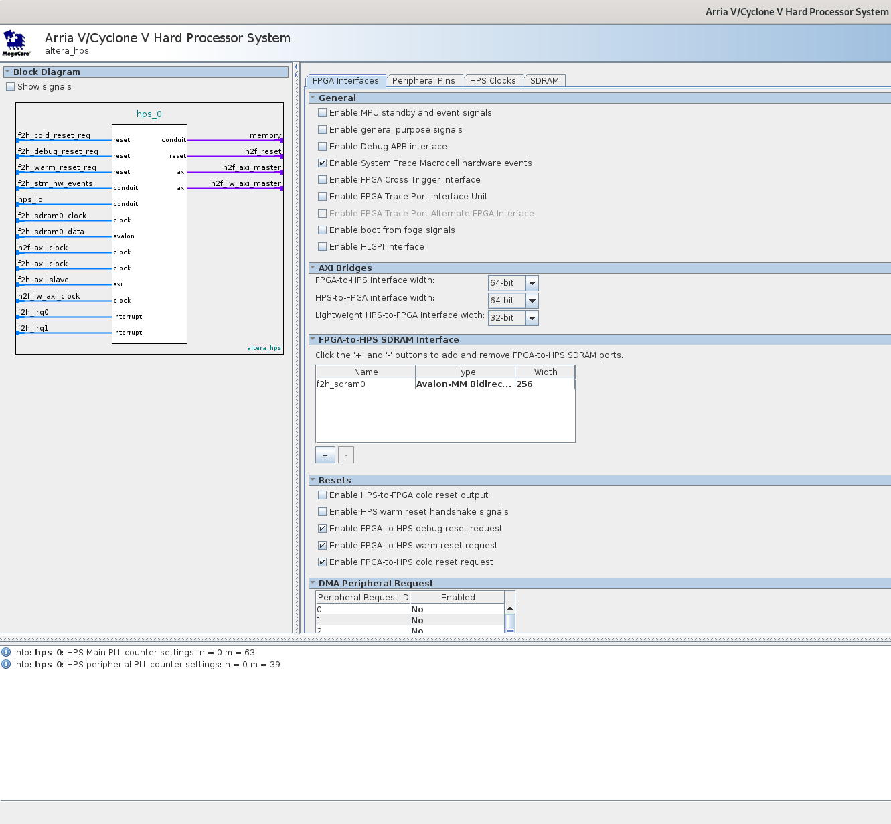
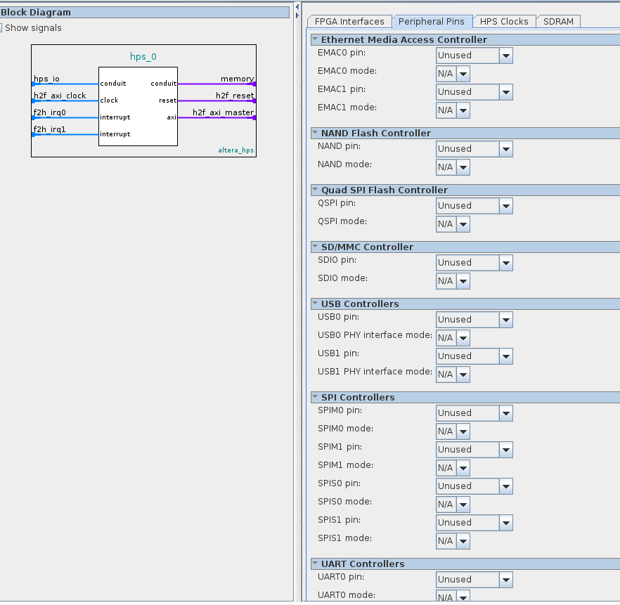
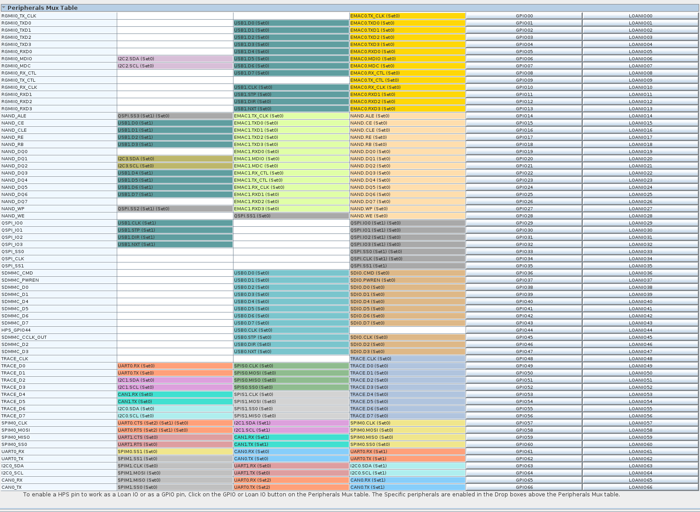
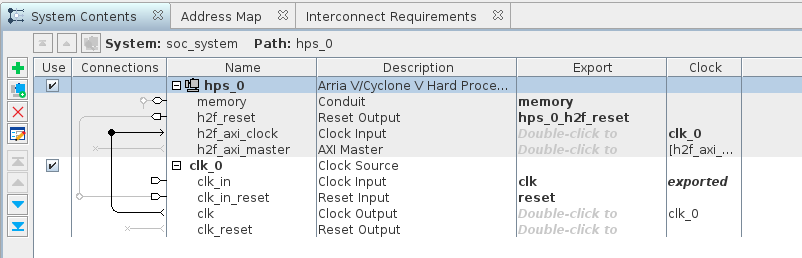
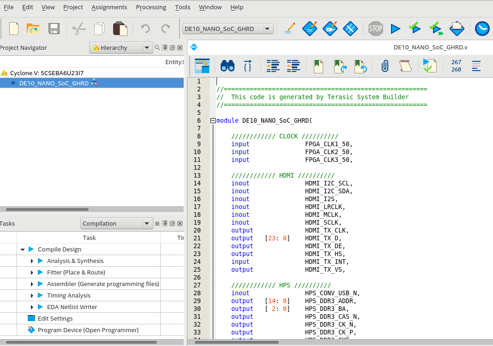
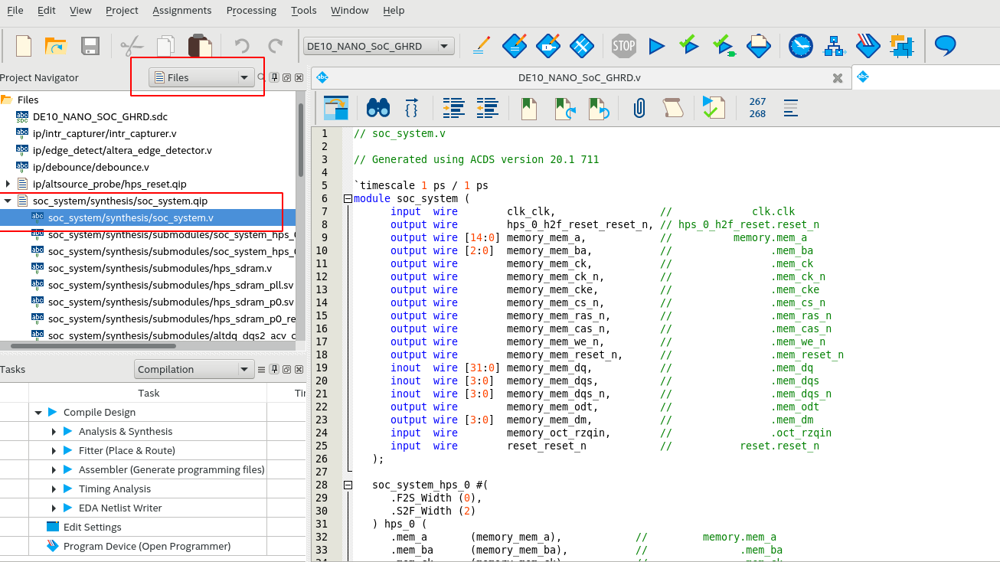

<!-- START doctoc generated TOC please keep comment here to allow auto update -->
<!-- DON'T EDIT THIS SECTION, INSTEAD RE-RUN doctoc TO UPDATE -->
**Table of Contents**  *generated with [DocToc](https://github.com/thlorenz/doctoc)*

- [Summary](#summary)
- [Getting the project ready](#getting-the-project-ready)
- [Upgrade the IP to current quartus version](#upgrade-the-ip-to-current-quartus-version)
    - [Platform Designer](#platform-designer)
      - [Startup](#startup)
      - [Trim the System](#trim-the-system)
      - [Trim the HDL Code](#trim-the-hdl-code)
      - [Compile the design](#compile-the-design)
    - [Why are we doing this?](#why-are-we-doing-this)
    - [Create a backup of this project](#create-a-backup-of-this-project)

<!-- END doctoc generated TOC please keep comment here to allow auto update -->

## Summary

We're going to create a template project and save it so that we can reuse it for other projects. To do this, we'll start with the GHRD project that comes with the de10-nano CD-ROM and remove a bunch of stuff to make it as simple as possible.

## Getting the project ready

Complete the following steps explained at the links below and proceed to the next section when done:

1. [Download the CD-ROM](https://github.com/zangman/de10-nano/wiki/Building-SoC-Design#download-the-cd-rom)
2. [Copy the GHRD to the working directory](https://github.com/zangman/de10-nano/wiki/Building-SoC-Design#copy-the-ghrd-to-working-directory)

## Upgrade the IP to current quartus version

Run the following command to fire up Quartus. I'm using 20.1 but the steps should be the same for newer versions also.

```bash
quartus &
```

Click on `Open Project` and select the `.qpf` file in the GHRD that we copied to the working directory:


You will see a note to upgrade IP. Click on the `Launch IP Upgrade Tool` and click on `Perform Automatic Upgrade`. Let it finish.


If you see an error saying that you need to upgrade it in Platform Designer, ignore it. It'll get upgraded in the next step. Hit the close button.


#### Platform Designer

##### Startup

Now let's fire up Platform Designer. In older versions of Quartus, this was called QSys, so you will still see a lot of references to it online. You can access it in `Tools -> Platform Designer`. Select `soc_system.qsys` in the file open dialog.


It should automatically upgrade your IP Cores to the current version.


##### Trim the System



The first time you look at the GHRD design in platform designer, it looks very daunting. But not to worry, in this step we'll simplify it to make it easier to understand what is going on. First, we'll remove all the components that are not absolutely essential. And this means everything except `clk_0` and `hps_0`. So go ahead and right click and select `Remove` or just hit the `Del` key on each of them. When done, your design should look like this:



Much better, but there's still too many features enabled in `hps_0`. Right click on it and select `Edit...`:



Let's make the following changes. In the first tab `FPGA Interfaces` make the following changes:

1. Disable `Enable System Trace Macrocell hardware events`
2. Under `AXI Bridges` set `FPGA-to-HPS interface width` to `Unused`.
3. Under `AXI Bridges` leave `HPS-to-FPGA interface width` as `64-bit`. We'll be using this interface and this should be the only option enabled in this tab.
4. Under `AXI Bridges` set `Lightweight HPS-to-FPGA interface width` to `Unused`.
5. Under `FPGA-to-HPS SDRAM Interface` remove `f2h_sdram0` by clicking the `-` button.
6. Under `Resets` disable everything.
7. Under `Interrupts` disable everything.

Click on the next tab `Peripheral Pins` and make the following changes:

1. Under there set every pin to `Unused`. We won't need any of the peripherals. It should look similar to this:

   

2. Scroll down and under the `Peripherals Mux Table`, disable every GPIO button that is currently enabled. It should look as follows when done:
   

Once done click on the `Finish` button at the bottom right. Your design should look as follows now:



Ho ho! Much better! If you see a warning about `set_interface_assignment: hps_io doesn't exist`, it's safe to ignore it.

Save the design with `Ctrl + s` and then click on `Generate HDL...` at the bottom right and click `Generate` with the default options.

Once it finishes generating the HDL, you can click on `Finish` to close Platform Designer.

##### Trim the HDL Code

Now that we removed so many features from the design, there's a lot of verilog code that we don't need anymore. Let's remove it.

Back in quartus, double-click the base design in hierarchy view to open the verilog file:



In `Project Navigator` switch to `Files` and open the soc base design called `soc_system.v`:



In the file `DE10_NANO_SoC_GHRD.v`, if you scroll down a bit, there is an instance of soc_system which includes a bunch of ports that are not needed anymore. There's also some IP for debouncing etc which are not needed anymore. We basically need to remove everything that's not of use.

You can do this yourself, or if you like, just copy the code below and paste it into `DE10_NANO_SoC_GHRD.v`:


```verilog


//=======================================================
//  This code is generated by Terasic System Builder
//=======================================================

module DE10_NANO_SoC_GHRD(

    //////////// CLOCK //////////
    input               FPGA_CLK1_50,
    input               FPGA_CLK2_50,
    input               FPGA_CLK3_50,

    //////////// HPS //////////
    output   [14: 0]    HPS_DDR3_ADDR,
    output   [ 2: 0]    HPS_DDR3_BA,
    output              HPS_DDR3_CAS_N,
    output              HPS_DDR3_CK_N,
    output              HPS_DDR3_CK_P,
    output              HPS_DDR3_CKE,
    output              HPS_DDR3_CS_N,
    output   [ 3: 0]    HPS_DDR3_DM,
    inout    [31: 0]    HPS_DDR3_DQ,
    inout    [ 3: 0]    HPS_DDR3_DQS_N,
    inout    [ 3: 0]    HPS_DDR3_DQS_P,
    output              HPS_DDR3_ODT,
    output              HPS_DDR3_RAS_N,
    output              HPS_DDR3_RESET_N,
    input               HPS_DDR3_RZQ,
    output              HPS_DDR3_WE_N,

    //////////// LED //////////
    output   [ 7: 0]    LED
);


//=======================================================
//  REG/WIRE declarations
//=======================================================
wire hps_fpga_reset_n;
wire                fpga_clk_50;
wire [6:0]	fpga_led_internal;

// connection of internal logics
assign LED[7: 1] = fpga_led_internal;
assign fpga_clk_50 = FPGA_CLK1_50;


//=======================================================
//  Structural coding
//=======================================================
soc_system u0(
               //Clock&Reset
               .clk_clk(FPGA_CLK1_50),                                      //                            clk.clk
               .reset_reset_n(hps_fpga_reset_n),                            //                          reset.reset_n
               //HPS ddr3
               .memory_mem_a(HPS_DDR3_ADDR),                                //                         memory.mem_a
               .memory_mem_ba(HPS_DDR3_BA),                                 //                               .mem_ba
               .memory_mem_ck(HPS_DDR3_CK_P),                               //                               .mem_ck
               .memory_mem_ck_n(HPS_DDR3_CK_N),                             //                               .mem_ck_n
               .memory_mem_cke(HPS_DDR3_CKE),                               //                               .mem_cke
               .memory_mem_cs_n(HPS_DDR3_CS_N),                             //                               .mem_cs_n
               .memory_mem_ras_n(HPS_DDR3_RAS_N),                           //                               .mem_ras_n
               .memory_mem_cas_n(HPS_DDR3_CAS_N),                           //                               .mem_cas_n
               .memory_mem_we_n(HPS_DDR3_WE_N),                             //                               .mem_we_n
               .memory_mem_reset_n(HPS_DDR3_RESET_N),                       //                               .mem_reset_n
               .memory_mem_dq(HPS_DDR3_DQ),                                 //                               .mem_dq
               .memory_mem_dqs(HPS_DDR3_DQS_P),                             //                               .mem_dqs
               .memory_mem_dqs_n(HPS_DDR3_DQS_N),                           //                               .mem_dqs_n
               .memory_mem_odt(HPS_DDR3_ODT),                               //                               .mem_odt
               .memory_mem_dm(HPS_DDR3_DM),                                 //                               .mem_dm
               .memory_oct_rzqin(HPS_DDR3_RZQ),                             //                               .oct_rzqin
              
               .hps_0_h2f_reset_reset_n(hps_fpga_reset_n)                  //                hps_0_h2f_reset.reset_n
      
           );


reg [25: 0] counter;
reg led_level;
always @(posedge fpga_clk_50 or negedge hps_fpga_reset_n) begin
    if (~hps_fpga_reset_n) begin
        counter <= 0;
        led_level <= 0;
    end

    else if (counter == 24999999) begin
        counter <= 0;
        led_level <= ~led_level;
    end
    else
        counter <= counter + 1'b1;
end

assign LED[0] = led_level;


endmodule

```

##### Compile the design

Save the file and compile the design. If everything went right, you should not see any errors (ignore the warnings).

#### Why are we doing this?

Strictly speaking, you don't need to do all these edits. But it helps to make it as simple as possible to understand what is actually going on under the hood. I've found this approach helpful for my own learning and hope you will find it useful too. It also compiles the design much faster. For me, the original design with everything takes about 15 mins to compile. The trimmed down version takes less than 10 mins. 

Of course, you can leave everything as is in the GHRD, in the platform designer as well as in quartus, and it will work perfectly.

#### Create a backup of this project

If everything compiles without errors, congratulations! Now you can go back to terminal and take a backup of the project. This will be useful to have as a barebones project to start with for new projects:

```bash
cd $DEWD
cp -r DE10_NANO_SoC_GHRD ghrd_barebones_template
```

Proceed to the next section on the right to start working on the design for the Simple Adder.