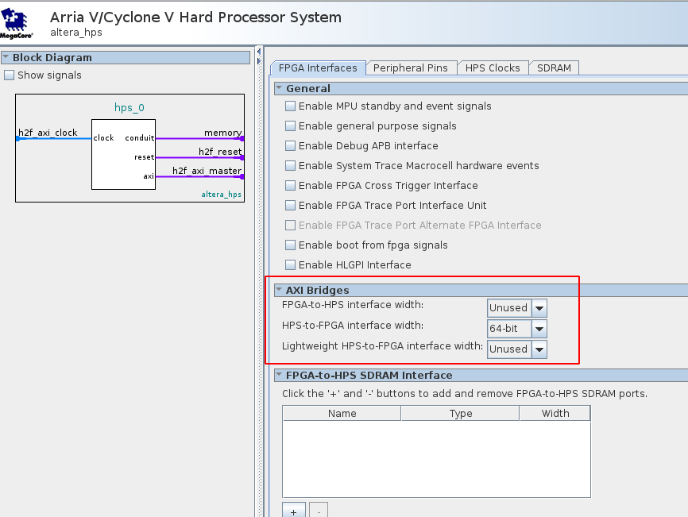
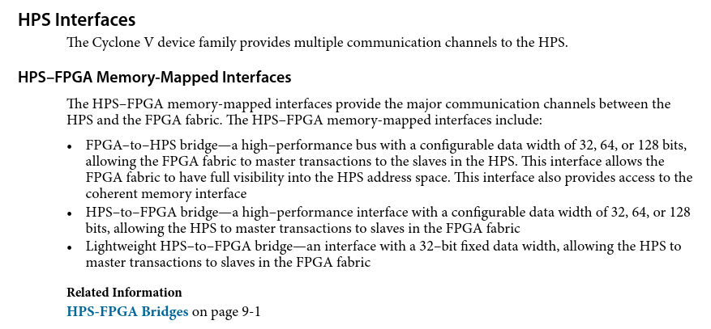
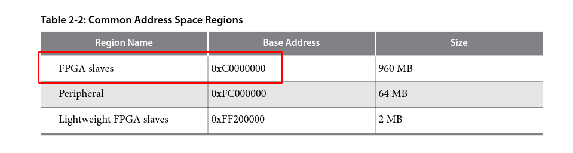

<a href="Simple-Hardware-Adder_-The-Adder.md">Back</a> | <a href="Simple-Hardware-Adder_-Custom-Avalon-MM-Components.md">Next</a> | <a href="../README.md#my-first-soc---simple-hardware-adder">Contents</a>
 
My First SoC - Simple Hardware Adder

# Primer on Avalon MM

<!-- START doctoc generated TOC please keep comment here to allow auto update -->
<!-- DON'T EDIT THIS SECTION, INSTEAD RE-RUN doctoc TO UPDATE -->

- [Summary](#summary)
- [Introduction to Buses](#introduction-to-buses)
- [Avalon Memory Map](#avalon-memory-map)
- [AXI Bridges](#axi-bridges)
- [Avalon Memory Map Interface](#avalon-memory-map-interface)
- [Learn more](#learn-more)
- [References](#references)

<!-- END doctoc generated TOC please keep comment here to allow auto update -->

## Summary

Here I will walk you through a high level summary of the Avalon Memory Map. I would recommend you go through the [detailed reference](https://www.intel.com/content/dam/www/programmable/us/en/pdfs/literature/manual/mnl_avalon_spec.pdf) to learn more about it.

## Introduction to Buses

Buses are fundamental to all digital electronic systems. They ensure that data is communicated from one module to another reliably. There are several popular Bus interfaces available to use these days and each of them have their pros and cons. Bus interfaces may also have different variations within them for specific functionalities. A few of the popular buses are:

- **AXI AMBA Bus Interface** - Owned and developed by ARM, this is used wherever ARM architectures are used whether they be hard-core (HPS) or soft-core (Ex: NIOS). This is pretty common with Xilinx boards as well.
- **Avalon Bus Interface** - This is owned by Altera/Intel and is what we'll use here as well. There are several variations of this bus (streaming, burst, pipelined, etc), but we'll only be concerning ourselves with the most basic form of Memory Map with as few signals as we can get away with.
- **Wishbone Bus** - This is an open source Bus that is quite popular as there are no licensing costs involved to use it.

## Avalon Memory Map

The Avalon Memory Map is quite simple. Every port on every module on the FPGA fabric can be made available to the HPS via a virtual memory location. This means that if we want to pass some data to the FPGA from our HPS, all we have to do is write to a memory location in the HPS and the FPGA will just pick it up. But how do we interface with the Avalon Memory Map? Using the AXI Bridge in the HPS.

If you recall, when we were editing the HPS in platform designer, we had enabled the `HPS-to-FPGA interface` in the `AXI Bridges` section. These bridges are a part of the ARM core that is used in the HPS in the Cyclone V. This bridge is basically what enables us to interface the HPS with the FPGA.

You may wonder why we're using AXI Bridges to interface with Avalon Bus and also how it works. ARM cores can only use AXI Bridges because that's what ARM own and licenses out. Platform Designer hides away the complexity of connecting it with the Avalon interface by automatically adding in an adaptor that converts AXI to Avalon. However, we need not worry about it here as this magic is hidden away from the user.

## AXI Bridges

There are 3 bridges available in the HPS:

1. **FPGA-to-HPS bridge** - This enables communication from the FPGA to the HPS. We won't be using this one.
2. **HPS-to-FPGA bridge** - This is also known as the heavyweight bridge which allows the HPS to communicate with the FPGA. It makes available 960MB of memory space for data transfer. It is high speed and should primarily be used for low latency data transfer.
3. **Lightweight HPS-to-FPGA bridge** - The lightweight bridge should primarily be used for control ports (enable read, get status etc). Most of the examples you see online use the lightweight bridge. This only has 2MB of memory space available and is slower than the heavyweight bridge. It's main purpose is to take away the pressure from the heavyweight bridge for reads and writes that don't require low latency.

In our case, we're going to use the heavyweight bridge because I had quite a bit of trouble getting it to work and there aren't too many examples online on this bridge.

The details of these bridges is explained in more detail in the [Cyclone V Technical Reference](https://www.intel.com/content/dam/www/programmable/us/en/pdfs/literature/hb/cyclone-v/cv_54001.pdf), here are a couple of screenshots:

## Avalon Memory Map Interface

To write a module that interfaces the Avalon Memory Map, we should adhere to the standard protocol that is required for this. There are 2 kinds of protocols that you can make use depending on the flow of information:

- Host (Previously called Master)
- Agent (Previously called Slave)

In this project, we're going to write our own Slave modules which will work with a Master module IP that manages them. There are several options for ports that we can use for our modules, but for slave modules, pretty much all of them are optional. Some of them are:

- clk
- reset
- write
- writedata
- read
- readdata
- address

There are many more that you can see in the specs in the references at the bottom. There are some constraints also like whenever you include `writedata` you need to include `write` as well. I won't go into these in detail though.

## Learn more

This is very very basic intro and I highly recommend going through the references to learn more about these Buses.

## References

- [YouTube tutorial - Custom component development using Avalon and AXI](https://www.youtube.com/watch?v=Vw2_1pqa2h0) - Highly recommend watching this video. It is quite long, but explains everything about the interface.
- [Avalon Memory Map Interface](https://www.intel.com/content/dam/www/programmable/us/en/pdfs/literature/manual/mnl_avalon_spec.pdf)

Next | <b><a href="Simple-Hardware-Adder_-Custom-Avalon-MM-Components.md">Custom Avalon MM Components</a></b>
 
Back | <b><a href="Simple-Hardware-Adder_-The-Adder.md">Simple Adder</a>

</b>
My First SoC - Simple Hardware Adder | <a href="../README.md#my-first-soc---simple-hardware-adder">Table of Contents</a>

