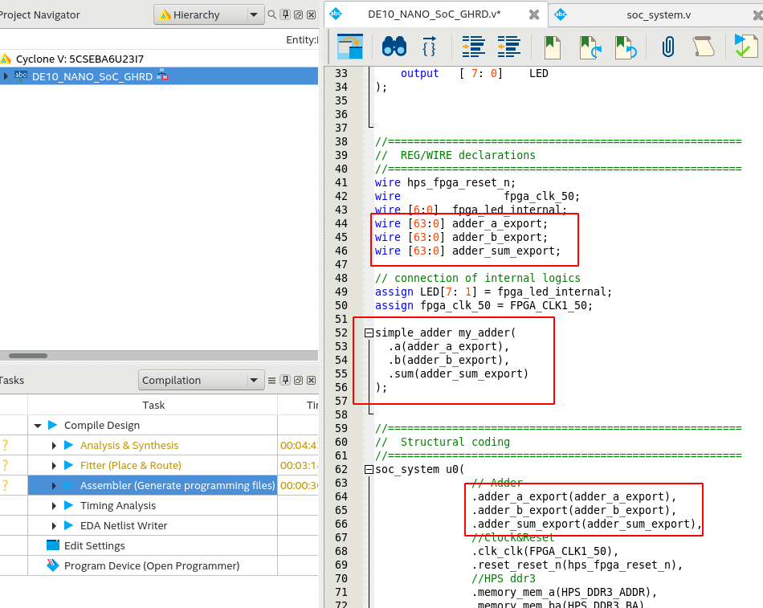
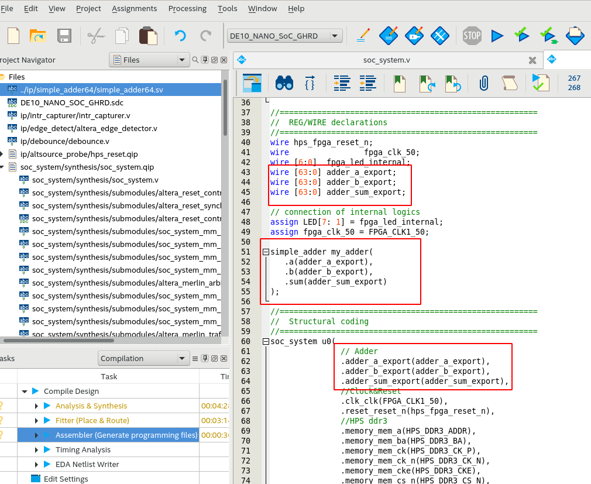

<!-- START doctoc generated TOC please keep comment here to allow auto update -->
<!-- DON'T EDIT THIS SECTION, INSTEAD RE-RUN doctoc TO UPDATE -->
**Table of Contents**  *generated with [DocToc](https://github.com/thlorenz/doctoc)*

- [Summary](#summary)
- [Add the design to the project](#add-the-design-to-the-project)
- [Wire it together](#wire-it-together)
- [Compile the design](#compile-the-design)
- [Configuring the Device Tree](#configuring-the-device-tree)
- [Flashing the design](#flashing-the-design)

<!-- END doctoc generated TOC please keep comment here to allow auto update -->

## Summary

Now let's add our Simple Adder design to the project and wire it up to our SoC. We're almost done with the hardware part!

## Add the design to the project

Back in quartus, switch over to `Files` view and right click on `Files` and select `Add/Remove files from project`. In the dialog box that opens, browse to the Simple Adder verilog design we created earlier and add it to the list of files.

Click on `Apply` and then `Ok` to close the dialog.

## Wire it together

Back in the `Files` view, double click and open `soc_system.v` which is as shown below. You will see that there are 3 64 bit ports added to the module `soc_system` which we need to connect to our Simple Adder:


Switch to `Hierarchy` view in the project navigator and double click to open the base design.



Let's add in the necessary wires, ports and modules to the design so that our adder is integrated. This is pretty standard verilog, so I won't go into detail. But here is a screenshot and I've copy pasted the entire file below:



> Note: There is one line in the file that is not needed anymore which I hadn't removed earlier. If it complains during compilation, then you can remove it as well. Or you can just copy paste the entire code from the block below.
>
> ```verilog
> .hps_0_h2f_reset_reset_n(hps_fpga_reset_n)
> ```

Here is the complete source code:

```systemverilog


//=======================================================
//  This code is generated by Terasic System Builder
//=======================================================

module DE10_NANO_SoC_GHRD(

    //////////// CLOCK //////////
    input               FPGA_CLK1_50,
    input               FPGA_CLK2_50,
    input               FPGA_CLK3_50,

    //////////// HPS //////////
    output   [14: 0]    HPS_DDR3_ADDR,
    output   [ 2: 0]    HPS_DDR3_BA,
    output              HPS_DDR3_CAS_N,
    output              HPS_DDR3_CK_N,
    output              HPS_DDR3_CK_P,
    output              HPS_DDR3_CKE,
    output              HPS_DDR3_CS_N,
    output   [ 3: 0]    HPS_DDR3_DM,
    inout    [31: 0]    HPS_DDR3_DQ,
    inout    [ 3: 0]    HPS_DDR3_DQS_N,
    inout    [ 3: 0]    HPS_DDR3_DQS_P,
    output              HPS_DDR3_ODT,
    output              HPS_DDR3_RAS_N,
    output              HPS_DDR3_RESET_N,
    input               HPS_DDR3_RZQ,
    output              HPS_DDR3_WE_N,

    //////////// LED //////////
    output   [ 7: 0]    LED
);


//=======================================================
//  REG/WIRE declarations
//=======================================================
wire hps_fpga_reset_n;
wire                fpga_clk_50;
wire [6:0]	fpga_led_internal;
wire [63:0] adder_a_export;
wire [63:0] adder_b_export;
wire [63:0] adder_sum_export;

// connection of internal logics
assign LED[7: 1] = fpga_led_internal;
assign fpga_clk_50 = FPGA_CLK1_50;

simple_adder my_adder(
  .a(adder_a_export),
  .b(adder_b_export),
  .sum(adder_sum_export)
);


//=======================================================
//  Structural coding
//=======================================================
soc_system u0(
               // Adder
		  .adder_a_export(adder_a_export),
		  .adder_b_export(adder_b_export),
		  .adder_sum_export(adder_sum_export),
               //Clock&Reset
               .clk_clk(FPGA_CLK1_50),                                      //                            clk.clk
               .reset_reset_n(hps_fpga_reset_n),                            //                          reset.reset_n
               //HPS ddr3
               .memory_mem_a(HPS_DDR3_ADDR),                                //                         memory.mem_a
               .memory_mem_ba(HPS_DDR3_BA),                                 //                               .mem_ba
               .memory_mem_ck(HPS_DDR3_CK_P),                               //                               .mem_ck
               .memory_mem_ck_n(HPS_DDR3_CK_N),                             //                               .mem_ck_n
               .memory_mem_cke(HPS_DDR3_CKE),                               //                               .mem_cke
               .memory_mem_cs_n(HPS_DDR3_CS_N),                             //                               .mem_cs_n
               .memory_mem_ras_n(HPS_DDR3_RAS_N),                           //                               .mem_ras_n
               .memory_mem_cas_n(HPS_DDR3_CAS_N),                           //                               .mem_cas_n
               .memory_mem_we_n(HPS_DDR3_WE_N),                             //                               .mem_we_n
               .memory_mem_reset_n(HPS_DDR3_RESET_N),                       //                               .mem_reset_n
               .memory_mem_dq(HPS_DDR3_DQ),                                 //                               .mem_dq
               .memory_mem_dqs(HPS_DDR3_DQS_P),                             //                               .mem_dqs
               .memory_mem_dqs_n(HPS_DDR3_DQS_N),                           //                               .mem_dqs_n
               .memory_mem_odt(HPS_DDR3_ODT),                               //                               .mem_odt
               .memory_mem_dm(HPS_DDR3_DM),                                 //                               .mem_dm
               .memory_oct_rzqin(HPS_DDR3_RZQ),                             //                               .oct_rzqin
               .hps_0_h2f_reset_reset_n(hps_fpga_reset_n)                   //                               .hps_0_h2f_reset.reset_n
      
           );


reg [25: 0] counter;
reg led_level;
always @(posedge fpga_clk_50 or negedge hps_fpga_reset_n) begin
    if (~hps_fpga_reset_n) begin
        counter <= 0;
        led_level <= 0;
    end

    else if (counter == 24999999) begin
        counter <= 0;
        led_level <= ~led_level;
    end
    else
        counter <= counter + 1'b1;
end

assign LED[0] = led_level;


endmodule


```


## Compile the design

Double click the `Assembler` in the left side menu and let the compilation complete. On my computer, it takes about 10 minutes to complete.

## Configuring the Device Tree

Before we can start using any of the bridges, we'll need to enable them in the device tree. This is covered over [here](https://github.com/zangman/de10-nano/wiki/Configuring-the-Device-Tree) so I won't be going into it again. In the de10-nano, check that the bridges are enabled with the following command. 

```bash
cat /sys/class/fpga_bridge/*/state
```

If they're `disabled` or you get an error then go through the steps described [here](https://github.com/zangman/de10-nano/wiki/Configuring-the-Device-Tree) and verify that the bridges are all enabled as shown on the same page.
## Flashing the design

Now we can flash our design on the de10-nano. This has already been covered [here](https://github.com/zangman/de10-nano/wiki/Flash-FPGA-from-HPS-(running-Linux)) and [here](https://github.com/zangman/de10-nano/wiki/Flash-FPGA-On-Boot-Up), so I won't be going into it here. You can use either method to flash the FPGA.

Once your design has been successfully flashed and you can see the blinking LED to indicate it is ready, we can now proceed to writing the software to use our hardware adder.

