
<a href="Simple-Hardware-Adder_-Custom-Avalon-MM-Components.md">Back</a> | <a href="Simple-Hardware-Adder_-Setting-up-the-Adder.md">Next</a> | <a href="../README.md#my-first-soc---simple-hardware-adder">Contents</a>
 
My First SoC - Simple Hardware Adder

# Wiring the Components

## Summary

Now we'll use the custom components we created in the previous step and wire them all together in platform designer and make the necessary edits.

## Components we'll use

To complete our simple design, we'll use the following components:

- **2 x Parallel IO 64 bit Output**: We'll use 2 instances of this component to map the inputs `a` and `b` to our simple adder.
- **1 x Parallel IO 64 bit Input**: We'll use 1 instance of this component to map the output `sum` from our simple adder.
- **Avalon-MM Pipeline Bridge**: We'll use this component from the IP Catalog for the following reasons:

  1.  Convert the AXI HPS-to-FPGA bridge to an Avalon MM bridge.
  1.  Specify the bus width as 64 bits.

  The image below shows where to find this component in the IP Catalog:
  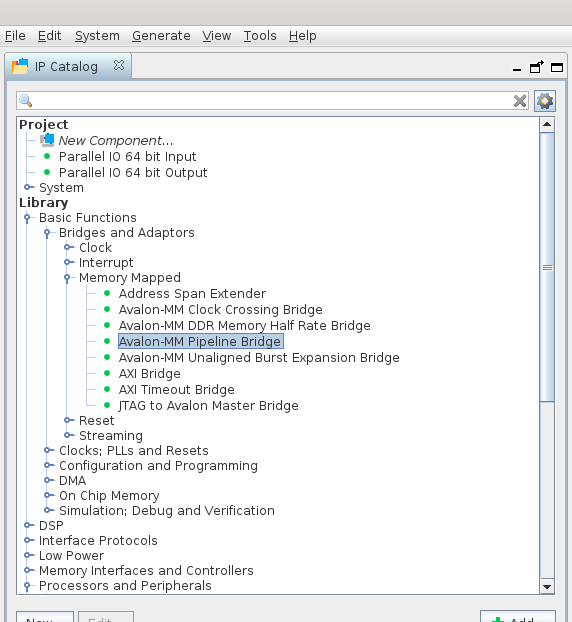

**Note**: We really don't need the Avalon-MM Pipeline Bridge. We can just connect an AXI Master to an Avalon MM Slave and Platform Designer is smart enough to automatically insert the necessary adaptors and converters to do what is necessary. But I like to include it explicitly because it shows what other options are available for us to tweak.

## Wiring the components

Let's start putting everything together. When you begin, your Platform Designer should look as follows:

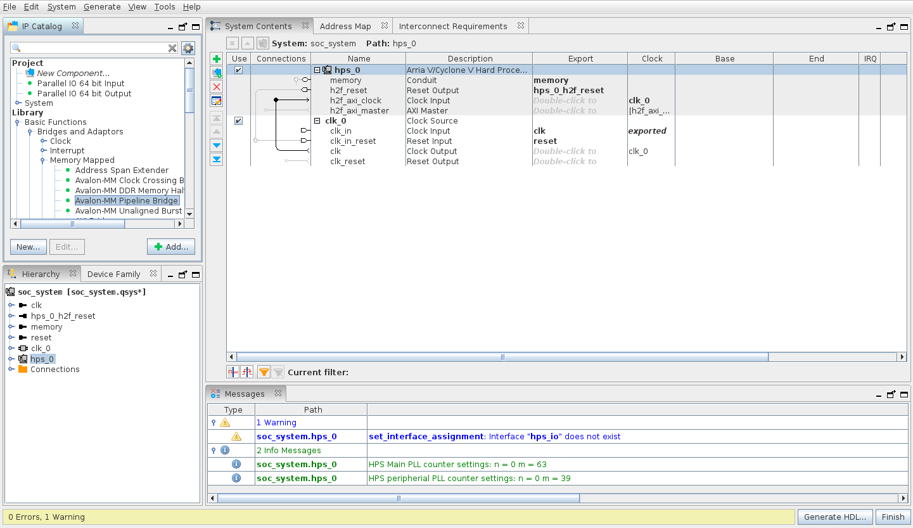

### Avalon-MM Pipeline Bridge

Double click on the `Avalon-MM Pipeline Bridge` to add it in the design and make the following adjustments in the config window:

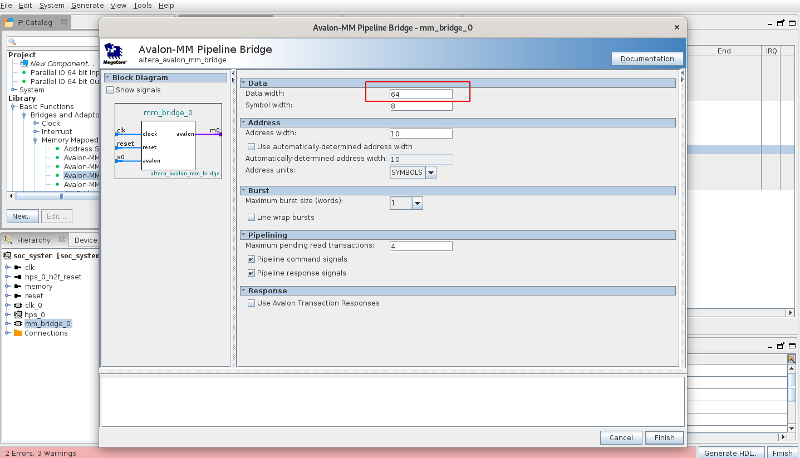

**Important**: Take note of the values in the `Data` section. Note that:

- `Data width` is 64 bits or 8 bytes wide.
- `Symbol width` is 8 bits or 1 byte wide.

This will be critical when we write the software to use our hardware adder in a subsequent section.

Complete the bridge configuration by wiring the signals as shown in the image below:

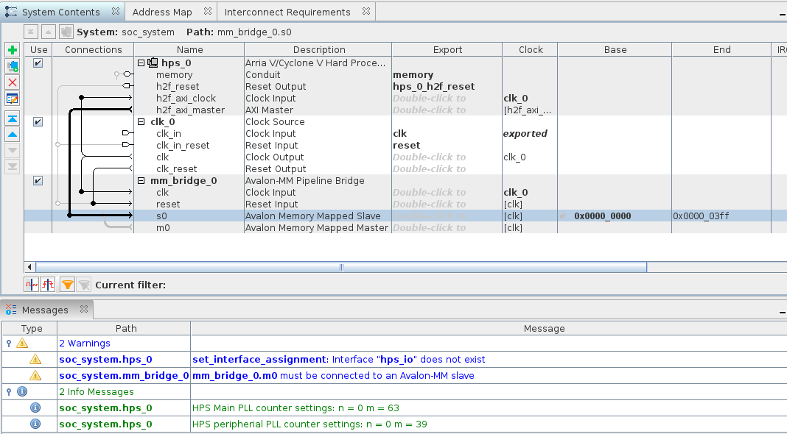

Things to take note:

- All `clk` signals should be connected to the same `clk` which in our case is from `clk_0`
- All `reset` signals are connected together and are driven by `clk_0.clk_reset`.
- `AXI Master` should connect to the `Avalon Memory Mapped Slave`. Hence we have connected `h2f_axi_master` to `s0`.
- The `Avalon Memory Mapped Master` will be connected to the other slaves in our design i.e. `m0`.

### Parallel IO 64 bit Output

Double-click on the output component that we just created. We don't have any configuration parameters, so just click `Finish` in the config window.

Repeat this step so that we have 2 output components in the design. Your screen should look as follows:

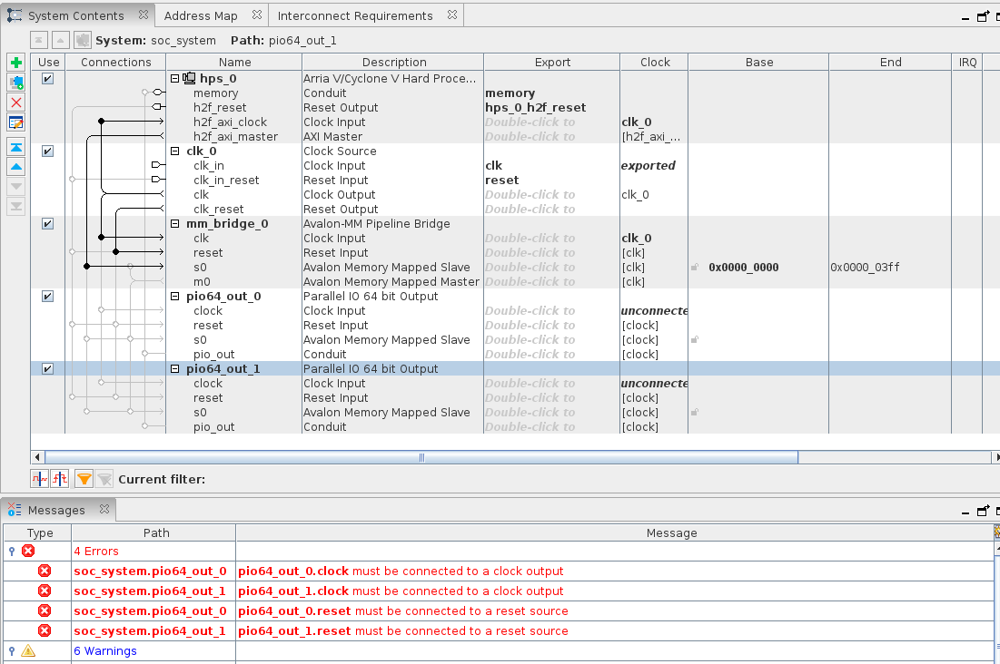

First step is to export our `Conduit` signals. This is so that they are available to be wired to the Simple Adder. For this double-click in the `Export` column next to `pio_out` for both the instances and rename them to `adder_a` and `adder_b`. Your screen should look as follows:

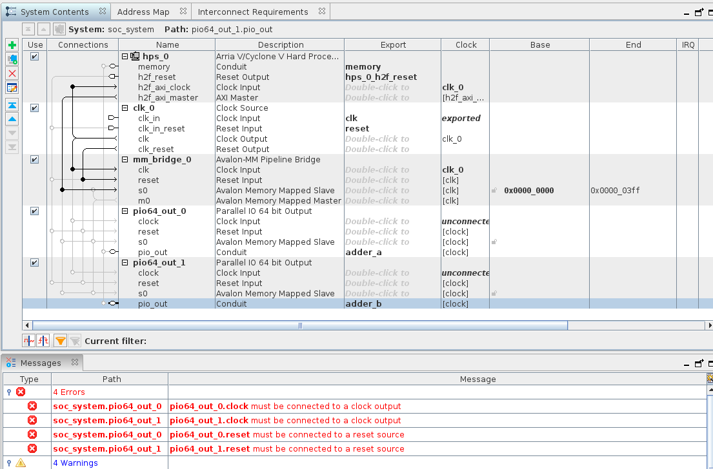

Let's connect the components to the rest of the design same as before. Only difference now is both the slave signals `s0` should be connected to the master `m0` on the bridge. After you complete, the screen should look as follows:

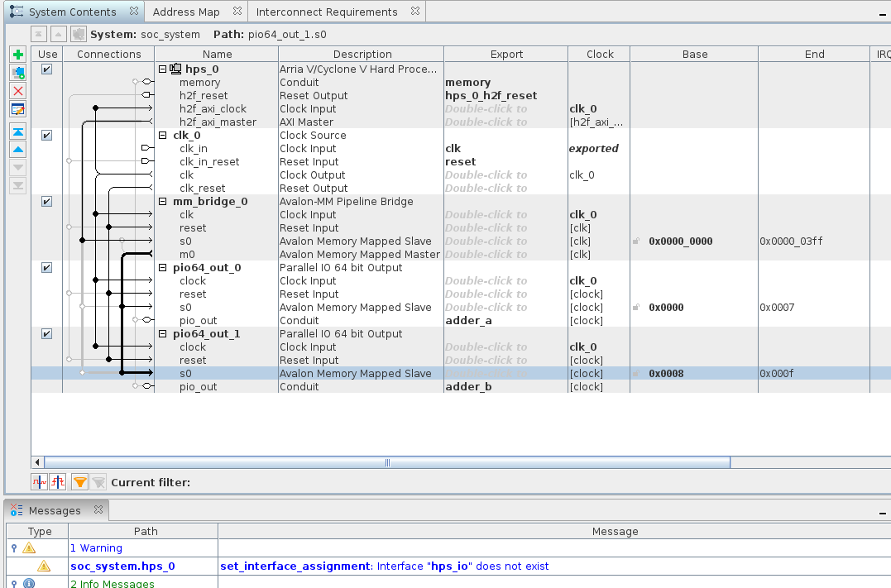

Don't worry about the error message just yet, we'll deal with it soon.

### Parallel IO 64 bit Input

Now repeat the same for the Input component. Only difference is the conduit should be exported as `adder_sum`, but otherwise the steps are exactly the same as adding the Output component. When done, your screen should look as follows:

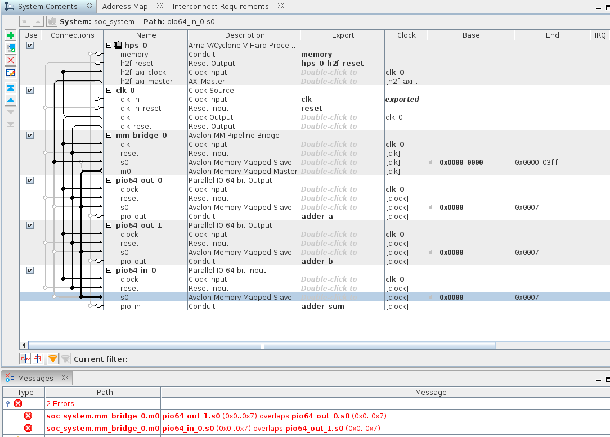

### Mapping the memory

Let's talk a little bit about the memory addressing. We want our components to be accessible from code running on the HPS by writing and reading to certain memory locations. This is done as follows:

1. **Memory location of the bus**: We are using the heavyweight AXI HPS-to-FPGA bridge. From the Cyclone V spec manual, we know that the address for this begins at `0xC0000000`. This is not relevant to us just yet, but putting it here for completeness. Strictly speaking, the components in our design will be addressable from this location onwards.

2. **Offset location of components**: Every component is available at a specific offset from the bus memory location. This is shown in the `Base` and `End`columns in platform designer. You can see that `mm_bridge_0` ranges from `0` to `0x3FF` i.e. a total of 1024 **_bytes_**. This is an important point to remember, all the addressing is done in **bytes**.

   Remember that we have defined our input and output components as 64 bit or **8 byte** components. This means that we need to provide **8 bytes** for each of our exported signals which can be either written to or read from.

   However, the `Base` and `End` addresses for all the 3 components that we added is exactly the same which won't work. Each one needs to have it's own non-overlapping address space.

   For this, we edit the values in the `Base` column to ensure they're not overlapping. I prefer to keep them continuous, but you can give any address as long as it's between `0` and `0x3FF` as provided by the bridge component. Here is what my screen now looks like:
   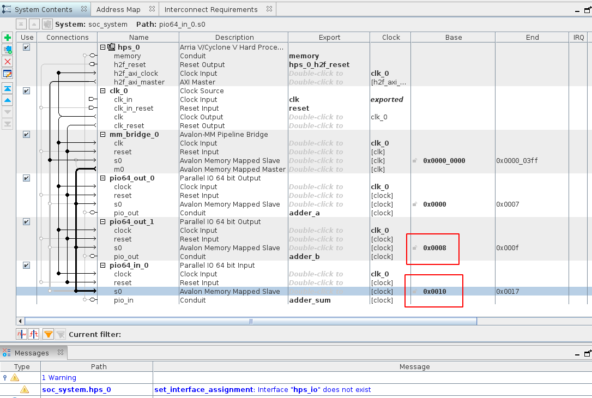

#### Auto adjust address width

One step I missed is to enable the option to automatically adjust the address width. If you right click on `mm_bridge_0` and click `Edit`, you'll see an option to specify the address width. Currently it is set to 10 which is why the address for the pipeline bridge ranges from 0 to 1023 (`0x03FF`) i.e. the if the address width is `n`, then the address range is from 0 to `(2^n)-1`.

However, we can enable an option to automatically determine the address width as shown below:

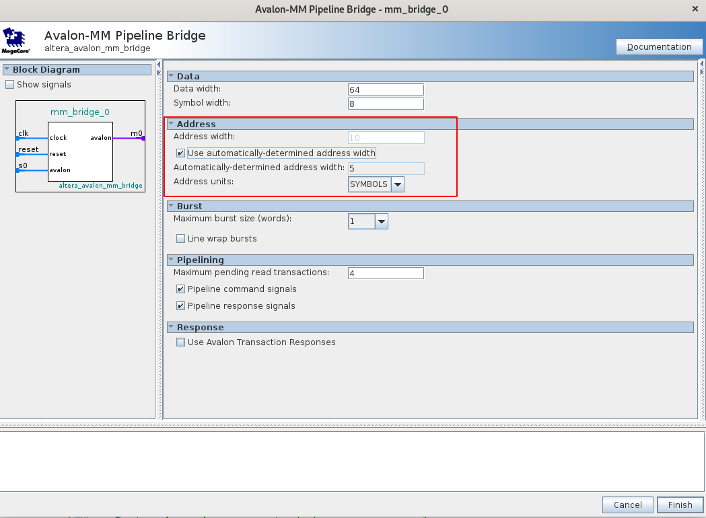

This automatically adjusts the address width depending on how many components we have connected. For me it selected 5. When I hit finish, the address `End` location is now `0x1F` or 31 as shown below `((2^5) - 1)`.

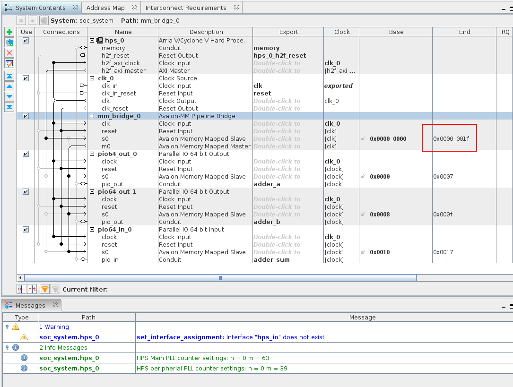

Note that the `End` addresses of our other components hasn't changed.

## Generate the HDL and Finish

Now that we have all the components, let's hit `Ctrl + s` to save and then click on the `Generate HDL...` button at the bottom right. This will generate the necessary HDL code for our design and add it to the project.

Once it completes, hit `Finish` to close Platform Designer.

Next we'll add our Simple Adder to our design and finish wiring everything.

##

Next | <b><a href="Simple-Hardware-Adder_-Setting-up-the-Adder.md">Add the Simple Adder</a></b>
 
Back | <b><a href="Simple-Hardware-Adder_-Custom-Avalon-MM-Components.md">Custom Avalon MM Components</a>

</b>
My First SoC - Simple Hardware Adder | <a href="../README.md#my-first-soc---simple-hardware-adder">Table of Contents</a>

