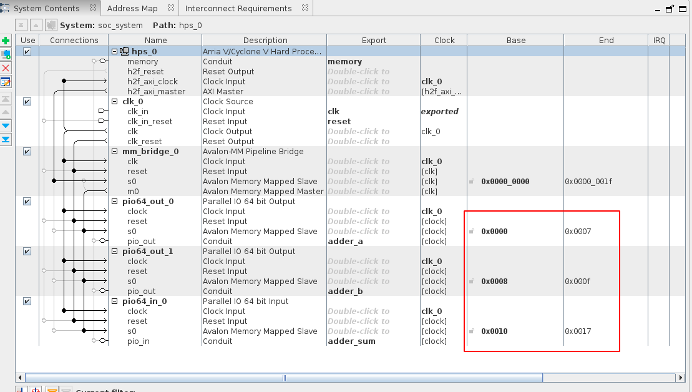
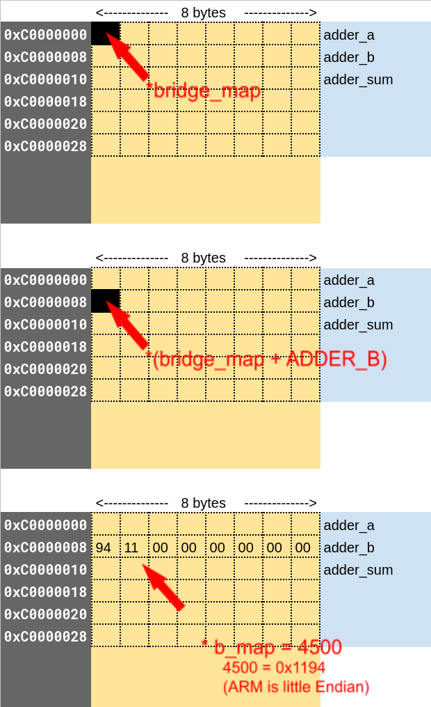

<!-- START doctoc generated TOC please keep comment here to allow auto update -->
<!-- DON'T EDIT THIS SECTION, INSTEAD RE-RUN doctoc TO UPDATE -->
**Table of Contents**  *generated with [DocToc](https://github.com/thlorenz/doctoc)*

- [Summary](#summary)
- [Writing the Code](#writing-the-code)
  - [Getting started](#getting-started)
  - [Required C headers](#required-c-headers)
    - [Address of HPS to FPGA Bridge](#address-of-hps-to-fpga-bridge)
  - [Address of the components](#address-of-the-components)
  - [Accept 2 numbers as arguments](#accept-2-numbers-as-arguments)
  - [Open /dev/mem](#open-devmem)
  - [Map the address of the bridge using mmap](#map-the-address-of-the-bridge-using-mmap)
  - [Map the address of the adder ports](#map-the-address-of-the-adder-ports)
  - [Writing the input values](#writing-the-input-values)
    - [(Optional) C Memory Addressing](#optional-c-memory-addressing)
  - [Printing the sum](#printing-the-sum)
  - [Wrap up](#wrap-up)
  - [Full program code](#full-program-code)
- [Compiling and Running on de10-nano](#compiling-and-running-on-de10-nano)
- [Troubleshooting](#troubleshooting)

<!-- END doctoc generated TOC please keep comment here to allow auto update -->

## Summary

Now the fun part, let's write a program to write 2 numbers to the specific memory address location and read the sum and print to the screen.

## Writing the Code

### Getting started

We'll write an application program in `C`. There are 2 ways to write this program:

1. **Writing on the de10-nano directly** - If you take this approach, you would just `ssh` into the de10-nano and then write your `C` program and compile it on the command line like so:

   ```bash
   gcc myprog.c -o myprog
   ```

2. **Writing on a host machine and copying the executable** - This is my preferred approach. We basically write the program on a different machine, which in my case is Debian running on virtualbox. Then we compile it using the ARM cross-compiler that we downloaded and set up the path in [this section](https://github.com/zangman/de10-nano/wiki/Setting-up-the-Development-Environment#arm-compiler). Using this approach, the command line to compile it is:

   ```bash
   ${CROSS_COMPILE}gcc myprog.c -o myprog
   
   # Copy the executable to de10-nano.
   scp myprog root@<ipaddress>:~
   ```

Either approach is fine.

Create an empty file in the text editor of your choice and give it a name you choose. I'll call mine `myprog.c`:

```bash
cd $DEWD
mkdir hps_fpga
cd hps_fpga
vim myprog.c
```

### Required C headers

There are a few header files we need to include. I won't go into the details, but these are mostly for having access to `open`, `close`, `mmap`, `atoi`, `printf` etc.

```C
#include <error.h>
#include <fcntl.h>
#include <stdint.h>
#include <stdio.h>
#include <stdlib.h>
#include <sys/mman.h>
#include <unistd.h>
```

#### Address of HPS to FPGA Bridge

The first step is to know the address locations to read and write from. Looking at the [Cyclone V technical reference](https://www.intel.com/content/dam/www/programmable/us/en/pdfs/literature/hb/cyclone-v/cv_54001.pdf), we can see that the heavyweight bus starts at `0xC0000000`:


So, let's add this to our code:

```C
#define BRIDGE 0xC0000000
```

### Address of the components

If you open Platform Editor, you can see the addresses for the ports to our Simple Adder here:



So let's add these addresses to our code as well:

```C
#define ADDER_A 0x00
#define ADDER_B 0x08
#define ADDER_SUM 0x10
```

Since we're looking at reading/writing to three 8 byte addresses, that means the total width of the memory we are interested in is about 24 bytes. Let's add this to the code:

```C
#define BRIDGE_SPAN 0x18
```

And let's just add `main`. The program should now look as follows:

```C
#include <error.h>
#include <fcntl.h>
#include <stdint.h>
#include <stdio.h>
#include <stdlib.h>
#include <sys/mman.h>
#include <unistd.h>

#define BRIDGE 0xC0000000
#define BRIDGE_SPAN 0x18

#define ADDER_A 0x00
#define ADDER_B 0x08
#define ADDER_SUM 0x10

int main(int argc, char** argv) {

}
```

### Accept 2 numbers as arguments

This is pretty straightforward:

```C
int main(int argc, char **argv) {
  uint64_t a = 0;
  uint64_t b = 0;
  uint64_t sum = 0;

  if (argc != 3) {
    perror("Only 2 numbers should be passed.");
    return -1;
  }

  a = strtoll(argv[1], NULL, 10);
  b = strtoll(argv[2], NULL, 10);

  return 0;
}
```

### Open /dev/mem

We will now access `/dev/mem` through a file descriptor object.  For more details on this, check out the [man page](https://man7.org/linux/man-pages/man4/mem.4.html), but in a nutshell, `/dev/mem` provides access to the physical and virtual memory as well as any memory mapped peripherals (such as Avalon MM peripherals).

This is done as follows:

```C
int fd = 0;

fd = open("/dev/mem", O_RDWR | O_SYNC);
if (fd < 0) {
    perror("Couldn't open /dev/mem\n");
    return -2;
}
```

### Map the address of the bridge using mmap

`mmap()` is a function which can be used to map a file or device into memory. For more details, check out the mmap [man page](https://man7.org/linux/man-pages/man2/mmap.2.html). In our case, we'll use it to map `/dev/mem`. This is done as follows:

```C
uint8_t* bridge_map = NULL;

bridge_map = (uint8_t*)mmap(NULL, BRIDGE_SPAN, PROT_READ | PROT_WRITE, 
                               MAP_SHARED, fd, BRIDGE);
if (bridge_map == MAP_FAILED) {
    perror("Couldn't map bridge.");
    close(fd);
    return -3;
}
```

Let's spend a minute here to understand what is going on.

If you recall from the wiring section in platform designer, the address space is always referred to in bytes. So if we are trying to address 24 bytes from memory, this needs to be done one byte at a time.

Therefore, our `bridge_map` variable, which is a pointer to the start of the bridge address is defined as a pointer to a single byte i.e. `uint8_t` which is the same as `unsigned char`.

However, `mmap` returns  `void*`, so I'm just casting it to a `uint8_t*` to make it clear for me. Note that you can just as well replace `uint8_t*` with `void*` everywhere when working with C.

This is because `void*` is an [extension in GCC](https://gcc.gnu.org/onlinedocs/gcc/Pointer-Arith.html) where the fictitious object `void` is considered to be 1 byte in size. Hence a lot of the examples you see online use `void*` when creating the map.

### Map the address of the adder ports

Using the `bridge_map` variable, we can now get the address to the `a`, `b` and `sum` ports of our Simple Adder, just by adding the respective address offsets to `bridge_map`. This is done as follows:

```C
uint8_t* a_map = NULL;
uint8_t* b_map = NULL;
uint8_t* sum_map = NULL;

a_map = bridge_map + ADDER_A;
b_map = bridge_map + ADDER_B;
sum_map = bridge_map + ADDER_SUM;
```

### Writing the input values

Now all that's left is writing the input values `a` and `b`. But hang on, the input values for our Simple Adder are 64 bit or 8 bytes. Our address pointer is only 1 byte. So how do we write it? If you're familiar with memory addressing using C, feel free to skip the next section.

#### (Optional) C Memory Addressing

This took me a while to understand, so I'll try and spend some time explaining here.

You can think of the memory as a continuous arrangement of 1 byte blocks. The addresses we have specified for `a`, `b` and `sum` are offset positions. That means, the positions of those addresses begin at the respective locations. What we need to do is count 8 bytes from that point onwards and fill it with our 64 bit numbers.

Let's take the example of input `b`. It is present at an offset of `0x08` from the `BRIDGE`. So we add this offset to the address of the `BRIDGE`:

```C
b_map = bridge_map + ADDER_B;
```

`b_map` is a pointer to 1 byte address. So if we want to write a 64 bit number or 8 bytes, we'll either need to:

1. Split the number into 8 parts of 1 byte each and write them one at a time.
2. Cast `b_map` to be a pointer to 8 byte address. Then we can directly assign the 64 bit number.

So, let's see how we can do this in C:

1. `b_map` is a pointer to 1 byte address. Let's convert it to a pointer to 8 byte address. This is done with a simple cast:

   ```C
   (uint64_t*) b_map
   ```

2. Now let's dereference it to get to the pointer, this just adds several parentheses:

   ```C
   *((uint64_t*) b_map)
   ```

3. Let's assign the input number to the address:

   ```C
   *((uint64_t*) b_map) = b;
   ```


The diagram below might make it more easy to understand:




So our code for the inputs and outputs now looks like this:

```C
*((uint64_t *)a_map) = a;
*((uint64_t *)b_map) = b;
sum = *((uint64_t *)sum_map);
```

### Printing the sum

Let's print the resulting sum of the two numbers. Since these are 64 bit numbers, printing is slightly more complicated. [This post](https://stackoverflow.com/a/9225648/1287554) explains it in more detail if you are interested:

```C
#include <inttypes.h>

printf("%" PRIu64 "\n", sum);
```

### Wrap up

All that's left now is to close the memory map and exit from the program:

```C
int result = 0;

result = munmap(bridge_map, BRIDGE_SPAN);

if (result < 0) {
  perror("Couldnt unmap bridge.");
  close(fd);
  return -4;
}

close(fd);
return 0;

```

### Full program code

Here's the full program:

```C
#include <error.h>
#include <fcntl.h>
#include <inttypes.h>
#include <stdint.h>
#include <stdio.h>
#include <stdlib.h>
#include <sys/mman.h>
#include <unistd.h>

#define BRIDGE 0xC0000000
#define BRIDGE_SPAN 0x18

#define ADDER_A 0x00
#define ADDER_B 0x08
#define ADDER_SUM 0x10

int main(int argc, char **argv) {
  uint64_t a = 0;
  uint64_t b = 0;
  uint64_t sum = 0;

  uint8_t *a_map = NULL;
  uint8_t *b_map = NULL;
  uint8_t *sum_map = NULL;

  uint8_t *bridge_map = NULL;

  int fd = 0;
  int result = 0;

  if (argc != 3) {
    perror("Only 2 numbers should be passed.");
    return -1;
  }

  a = strtoll(argv[1], NULL, 10);
  b = strtoll(argv[2], NULL, 10);

  fd = open("/dev/mem", O_RDWR | O_SYNC);

  if (fd < 0) {
    perror("Couldn't open /dev/mem\n");
    return -2;
  }

  bridge_map = (uint8_t *)mmap(NULL, BRIDGE_SPAN, PROT_READ | PROT_WRITE,
                               MAP_SHARED, fd, BRIDGE);

  if (bridge_map == MAP_FAILED) {
    perror("mmap failed.");
    close(fd);
    return -3;
  }

  a_map = bridge_map + ADDER_A;
  b_map = bridge_map + ADDER_B;
  sum_map = bridge_map + ADDER_SUM;

  *((uint64_t *)a_map) = a;
  *((uint64_t *)b_map) = b;
  sum = *((uint64_t *)sum_map);

  printf("%" PRIu64 "\n", sum);

  result = munmap(bridge_map, BRIDGE_SPAN);

  if (result < 0) {
    perror("Couldnt unmap bridge.");
    close(fd);
    return -4;
  }

  close(fd);
  return 0;
}
```

## Compiling and Running on de10-nano

Now, we just need to compile and run the program on the de10-nano:

```bash
# In Debian on virtualbox.
${CROSS_COMPILE}gcc myprog.c -o myprog

# Copy it to de10-nano.
scp myprog root@<ipaddress>:~
```

To run it on the de10-nano, first `ssh` into the device and then, if everything went well:

```bash
root@de10-15aug21:~# ./myprog 100 200
300
```

Note that a 64 bit number can have up to 18 digits, so this can handle pretty large numbers as input.

## Troubleshooting

If your program makes the de10-nano hang and unresponsive or it returns garbage or doesn't work as expected, here's a list of things you can maybe start with.

Unfortunately, this happens quite often and the bad news is, there is no easy way to debug these issues. The problem can be anywhere, so be prepared to spend a bit of time trying to fix this.

1. Check the memory address locations and if you are reading and writing to them correctly as shown in Platform Designer.

2. Check that the `HPS-to-FPGA` bridge is enabled in Platform Designer for the HPS component and it is set to 64 bit.

3. Check in Platform Designer that you have 2 Parallel IO **_OUTPUT_** components for `a` and `b` of our Simple Adder and 1 Parallel IO **_INPUT_** component for the `sum`.

4. Re-check the wiring in the Platform Designer that the signals are connected correctly. There are multiple signals that are named similarly (`clk`, `clk_in` etc), so it's quite easy to make a mistake.

5. Check that your base design actually instantiates the Simple Adder and is wired correctly i.e. `simple_adder myadder ( ... );`

6. Check that the bridge interfaces are `enabled` on your de10-nano by running the following command:

   ```bash
   cat /sys/class/fpga_bridge/*/state
   ```

7. Check the verilog and C code with the reference source code if there are any mistakes.

8. Make sure the `MSEL` pins are all set to `ON` as described [here](https://github.com/zangman/de10-nano/wiki/Flash-FPGA-from-HPS-(running-Linux)#set-the-msel-pins).

If unable to find the problem, maybe it's better to just start over again. I've done this countless times and it is the price to pay for learning.

## Appendix

### C++ Program

For reference, here is the same program re-written in C++:

```C++
#include <iostream>

#include <fcntl.h>
#include <sys/mman.h>
#include <unistd.h>

int main(int argc, char **argv) {

  constexpr uint32_t BRIDGE = 0xC0000000;
  constexpr uint32_t BRIDGE_SPAN = 0x18;

  constexpr uint32_t ADDER_A = 0x00;
  constexpr uint32_t ADDER_B = 0x08;
  constexpr uint32_t ADDER_SUM = 0x10;

  uint64_t a = 0;
  uint64_t b = 0;
  uint64_t sum = 0;

  uint8_t *a_map = NULL;
  uint8_t *b_map = NULL;
  uint8_t *sum_map = NULL;

  uint8_t *bridge_map = NULL;

  int fd = 0;
  int result = 0;

  if (argc != 3) {
    std::cerr << "Only 2 numbers should be passed.\n";
    return -1; 
  }

  a = std::stoll(argv[1]);
  b = std::stoll(argv[2]);

  fd = open("/dev/mem", O_RDWR | O_SYNC);

  if (fd < 0) {
    std::cerr << "Couldn't open /dev/mem\n";
    return -2; 
  }

  bridge_map = static_cast<uint8_t *>( 
      mmap(NULL, BRIDGE_SPAN, PROT_READ | PROT_WRITE, MAP_SHARED, fd, BRIDGE));

  if (bridge_map == MAP_FAILED) {
    std::cerr << "mmap failed.";
    close(fd);
    return -3; 
  }

  a_map = bridge_map + ADDER_A;
  b_map = bridge_map + ADDER_B;
  sum_map = bridge_map + ADDER_SUM;

  *(reinterpret_cast<uint64_t *>(a_map)) = a;
  *(reinterpret_cast<uint64_t *>(b_map)) = b;

  sum = *(reinterpret_cast<uint64_t *>(sum_map));

  std::cout << sum << std::endl;

  result = munmap(bridge_map, BRIDGE_SPAN);
  
  if (result < 0) {
    std::cerr << "Couldnt unmap bridge.\n";
    close(fd);
    return -4;
  }

  close(fd);
  return 0;
}

```

Compile this as follows:

```bash
${CROSS_COMPILE}g++ -std=c++17 myprog.cc -o myprog
```

