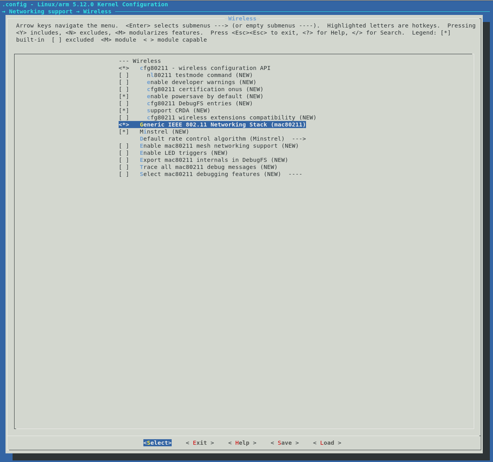
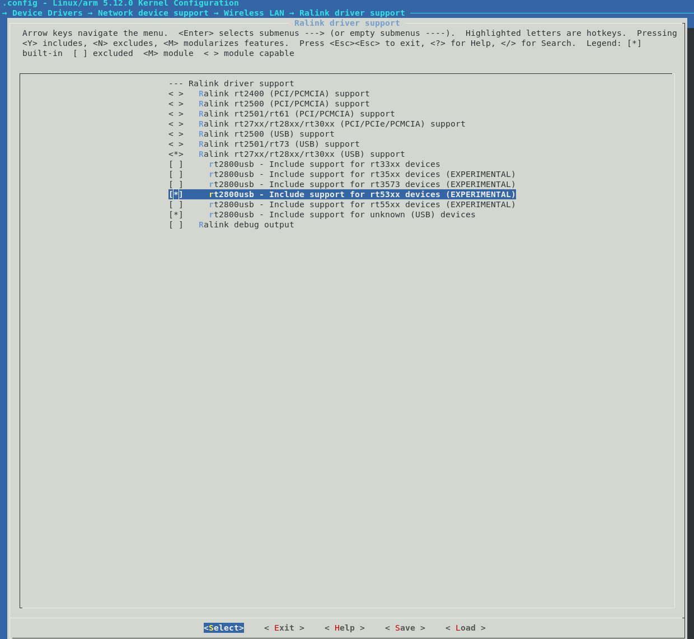

<!-- START doctoc generated TOC please keep comment here to allow auto update -->
<!-- DON'T EDIT THIS SECTION, INSTEAD RE-RUN doctoc TO UPDATE -->
**Table of Contents**  *generated with [DocToc](https://github.com/thlorenz/doctoc)*

- [Setting Up WIFI](#setting-up-wifi)
  - [Compile the kernel driver](#compile-the-kernel-driver)
  - [Copy the module to the FAT partition of the SD card](#copy-the-module-to-the-fat-partition-of-the-sd-card)
  - [Install the necessary firmware](#install-the-necessary-firmware)
  - [Device configuration](#device-configuration)
    - [Install wpa-supplicant](#install-wpa-supplicant)
    - [Configure wpa-supplicant](#configure-wpa-supplicant)
    - [Configure /etc/network/interfaces](#configure-etcnetworkinterfaces)
    - [Enable the service](#enable-the-service)
    - [Prevent wlan0 renaming](#prevent-wlan0-renaming)
  - [References](#references)

<!-- END doctoc generated TOC please keep comment here to allow auto update -->

<p align="right"><sup><a href="Building-the-SD-Card-image.md">Back</a> |</sup><a href="../README.md#getting-started"><sup>Contents</sup></a>
<br/>
<sup>Building Embedded Linux - Full Custom</sup></p>

# Setting Up WIFI

If you've followed the steps with building Debian as shown earlier, the ethernet should work out of the box. Just plug in a LAN cable and it should work.

But if you want to use a WIFI module, there are some more steps that are needed. Here we'll go through the steps to get wifi working for the RT5370 chipset and specifically this [USB Wifi module](https://www.mouser.sg/ProductDetail/Olimex-Ltd/MOD-WIFI-R5370-ANT?qs=J7x7253A5u4LBh0Sy0UYWQ==). Nothing special about it, I just bought it along with my de10-nano board and hence I'm explaining it here.

If you own a different wifi module, your steps may vary a bit. But if you get it working I would appreciate it if you could document it and send a pull request to document it here for everyones benefit.

## Compile the kernel driver

The first step is to enable the WIFI driver in the kernel. The steps listed here are taken from [this forum post](https://www.element14.com/community/community/designcenter/single-board-computers/riotboard/blog/2015/01/27/setup-mediatek-rt5370-wifi-on-riotboard-ubuntu-platform) on element14.

```bash
cd $DEWD
cd linux-socfpga
make ARCH=arm menuconfig
```

First step is to enable mac80211 linux stack for wireless lan. This will make RT5370 drivers available in menuconfig. This can be enabled as shown in the screenshot below:



Next, follow the chain as shown below and enable the option at every step to be compiled along with the kernel i.e. it should have an asterisk `*` and not an `M`. For this, press `Y` on the option to force it to be included in the kernel image. This is shown below:



Once completed, press right and select exit on all the screens and select the option to save when it asks you.

Back on the terminal, compile the kernel image with the following command (same as before):

```bash
make ARCH=arm LOCALVERSION=zImage -j 24
```

## Copy the module to the FAT partition of the SD card

You need to replace the zImage file in the FAT partition of the SD card. You can do this either by plugging the SD card to your computer and replacing it, or using `scp` to copy it to your already running de10-nano, mounting the FAT partition and replacing the kernel image file. I think this is pretty straightforward, so won't go through it in detail.

## Install the necessary firmware

The steps from here on require the de10-nano to be connected to the internet via a LAN cable.

Interestingly, the required firmware for this WIFI dongle needs to be installed separately. For this, we need to install the following package on the de10-nano. This may be different if you are using a different device. Remember to ssh into the device or login with the serial port:

```bash
apt update
apt install firmware-ralink
```

Now we have the firmware and the drivers in place. We're not out of the woods yet, still need to configure the device.

## Device configuration

All the steps below require you to have an active root terminal on the de10-nano and perform them there.

### Install wpa-supplicant

It's supposed to work without using this, but I couldn't get it to work. So I'll just document the part with wpa-supplicant. First, let's install it:

```bash
apt install wireless-tools -y
apt install wpasupplicant -y
```

### Configure wpa-supplicant

Run the following command to configure wpa-supplicant:

```bash
wpa_passphrase <myssid> <mypassword> > /etc/wpa_supplicant/wpa_supplicant.conf
```

Remember to replace `<myssid>` and `<mypassword>` with the WIFI name and password for your home. I'm assuming you use WPA2.

Check the config file to see it created correctly:

```bash
cat /etc/wpa_supplicant/wpa_supplicant.conf

network={
        ssid="myssid"
        #psk="mypassword"
        psk=1bc4ebbasdf9b365dbf3adfd12asdfbd891d8e67f3e3dfb1013bc9c3f9c8c127
}

```

Copy the long string `psk` and save it somewhere. We'll use it in the next step.

### Configure /etc/network/interfaces

Open the interfaces file and update it as follows. Note that if you see a line saying `auto eth0`, you should replace it with `allow-hotplug eth0`. Otherwise you might see a message at bootup saying "A start job is running to raise network" which can take 5 mins.

```bash
vim /etc/network/interfaces
```

```bash
source-directory /etc/network/interfaces.d
auto lo eth0
iface lo inet loopback

allow-hotplug eth0
iface eth0 inet dhcp

# Wifi config.
allow-hotplug wlan0
iface wlan0 inet dhcp
  wpa-ssid myssid
  wpa-psk 1bc4ebbasdf9b365dbf3adfd12asdfbd891d8e67f3e3dfb1013bc9c3f9c8c127

```

The Wifi config section in the file above ensures the wifi module is started at boot time.

### Enable the service

The last step is to enable the wpa_supplicant service to start at boot time. This is done with the following command:

```bash
systemctl reenable wpa_supplicant.service
```

### Prevent wlan0 renaming

For some reason the device name of my wifi card keeps getting renamed from wlan0 to something obscure which prevents it from working. To fix this, I need to add `net.ifnames=0` to the kernel boot parameters in `extlinux.conf` as shown below:

```bash
LABEL Linux Default
    KERNEL ../zImage
    FDT ../socfpga_cyclone5_de0_nano_soc.dtb
    APPEND root=/dev/mmcblk0p2 rw rootwait earlyprintk console=ttyS0,115200n8 net.ifnames=0
```

And that's it. Hopefully if you've got the steps right, the wifi should be working now.

## References

- [This forum post](https://www.element14.com/community/community/designcenter/single-board-computers/riotboard/blog/2015/01/27/setup-mediatek-rt5370-wifi-on-riotboard-ubuntu-platform) on element14.

<p align="right">Next | <b><a href="Flash-FPGA-from-HPS-running-Linux.md">Flashing the FPGA from Linux</a></b>
<br/>
<p align="right">Back | <b><a href="Building-the-SD-Card-image.md">Creating the SD Card Image</a></p>
</b><p align="center"><sup>Building Embedded Linux - Full Custom | </sup><a href="../README.md#building-embedded-linux---full-custom"><sup>Table of Contents</sup></a></p>
